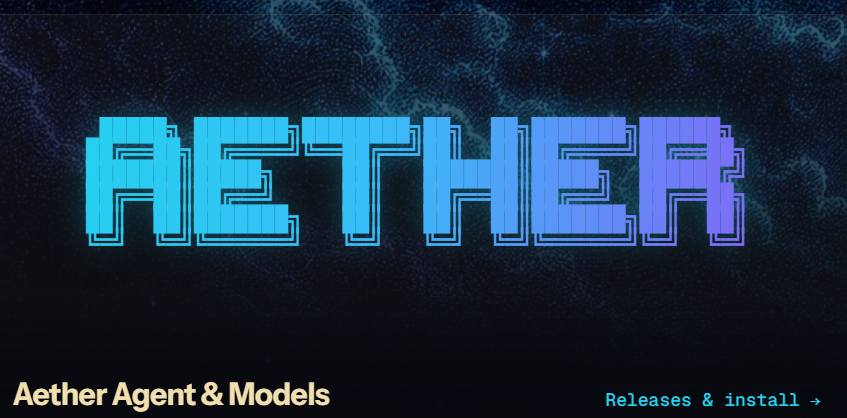

<div align="center">



# Aether Agent

**Build, test, and review from your terminal.**

An open-source coding agent that reads your repository, makes changes, and runs your checks.
Choose hosted models or local Ollama. Keep working in the same terminal.

[](https://github.com/AetherAI3/aether-agent/actions/workflows/ci.yml)
[](https://www.npmjs.com/package/aether-agents)
[](https://pypi.org/project/aether-agent/)
[](https://nodejs.org/)
[](LICENSE)

[Quickstart](#quickstart) · [v4.20.0 update](#whats-new-in-v4200) · [Features](#what-you-can-do) · [Models](#choose-your-model) · [Terminal](#chat-and-terminal) · [Docs](#documentation) · [Contribute](#build-and-contribute)


<sub>Install → launch → /help → /models</sub>

</div>

<!-- SOURCE-0.3-WORKFLOWS:START -->

## What you can do

| Workflow | What you get |
|---|---|
| **Code and verify** | Repository search, file edits, Git tools, and checks with real exit codes. |
| **Chat and use your shell** | Run `!commands` between messages; open an interactive terminal on Linux. [Terminal guide ↓](#chat-and-terminal) |
| **Choose your model** | Hosted account models or local Ollama with no account required. [Model setup ↓](#choose-your-model) |
| **Continue your work** | Resume project sessions, review changes, and export redacted handoffs. [Commands ↓](#everyday-commands) |
| **Connect tools** | MCP servers, agent skills, and local development previews. [Command reference](docs/generated/commands.md) |
| **Use account agents** | Shared Online conversations and guided ATS workspace setup. [Account agents ↓](#account-agents-and-ats) |

## Quickstart

**Node.js 24+ required.** Run inside the repository you want to work on:

```bash
npm install -g aether-agents@latest --ignore-scripts
aether auth login
aether
```

Type `/help` for commands or `/models` to choose a model. For a coding task with a specific check:

```bash
aether agent --test-cmd "npm test" "fix the failing test"
```

For a multiline task, save the specification in `task.md` and run
`aether agent --prompt-file task.md`. You can also pipe UTF-8 text to
`aether agent --prompt-file -` (for example,
`cat task.md | aether agent --prompt-file -`). The whole input is one literal
coding task; see [prompt input rules](COMMANDS.md#aether-code-task--autonomous-coding-agent)
for the size limit and flag conflicts.

To inspect the current checkout and receive a plan without changing it, run
`aether agent --planning "outline the migration"`, or use `/plan <topic>` in a
local interactive session. Planning permits only file reading, directory
listing, and repository search; it skips worktree creation and verification.
Save a plan or execute a phase later through the explicit goal controls.
The cloud chat route refuses `/plan` because its tools execute on the server.

A completed check records its exit code. Changing the repository makes that verification stale until you run it again.

The npm CLI is published as **v4.20.0**. Run `aether --version` to check the
version you have installed. For a fixed install, use
`npm install -g aether-agents@4.20.0 --ignore-scripts`.

Prefer Python? `pipx install aether-agent` installs a launcher for the same CLI. [Python setup](packages/pypi-cli/README.md).

## What's new in v4.20.0

- **Stay in control of a task.** `/steer` updates the active run; switching
  models continues it. Saved goals can execute a phase with host verification.
- **Review before sharing.** Inspect, edit, or cancel queued input, and preview
  shell output before attaching it to a model turn. Repeated tool failures pause
  at a recovery checkpoint.
- **Work comfortably across terminals.** Search installed Ollama models in the
  picker, opt into a persistent PowerShell session on Windows, and draft PR
  descriptions from final branch evidence.
- **See more honest status.** Remote viewing reports measured host and run state;
  account-agent chat distinguishes saved messages from admitted runs.

See the [full v4.20.0 release notes](RELEASE_NOTES.md)
for fixes, install options, and qualification limits.

## Choose your model

| Hosted | Local Ollama |
|---|---|
| Sign in with `aether auth login`. | No Aether account required. |
| `aether models` shows your account's available models. | Use a model installed at your Ollama endpoint. |
| Coding tasks send prompts and selected context to Aether; tools and checks run in your checkout through `aether agent`. | Inference stays at your configured endpoint, which defaults to loopback. |

To use [Ollama](https://ollama.com/), install and start it, then run:

```bash
aether setup --local
aether local pull qwen2.5-coder:7b --yes
aether local use qwen2.5-coder:7b --yes
aether agent --local --test-cmd "npm test" "fix the failing test"
```

If you set `OLLAMA_HOST` to a remote endpoint, prompts go there. Network tools have their own permissions.

<details>
<summary>Browse the offline model catalogue</summary>

<!-- MODEL-CATALOGUE:START -->
A dated, sanitized offline fallback snapshot is available as [HTML](docs/model-catalogue/index.html), [JSON](docs/model-catalogue/catalogue.json), and [Markdown](docs/generated/model-catalogue.md). It was generated at `2026-09-22T01:47:56.169Z` from Cloud public projection `model-catalogue-v1` with verified digest `sha256:f5f516625932d8932bfca221aa5dbf3eb1d7b415eba8dabe298da24b984c64f7`. Listed availability is not an account entitlement; use `aether models` while signed in.
<!-- MODEL-CATALOGUE:END -->

</details>

## Chat and terminal

In the local coding console, switch between conversation and your own commands:

```text
Explain the failing test
!npm test
/shell-result
/shell-result lines
/shell-result drop 8-10
/shell-result send
```

`!commands` run locally with **zero model API calls**. Output streams into the console with an exit code. `/shell-result` stages and previews the exact bounded attachment, including the command, captured directory, exit status, and any omitted bytes. Edit it with `drop`, `replace`, `mask`, or `redact`, then choose `/shell-result send` or `/shell-result cancel`. Redaction helps identify common secrets but does not guarantee their removal. A later shell command cannot change the staged attachment. For pipes and JSON sessions, `/shell-result send` is the explicit one-step send form.

| Platform | Local shell | Interactive programs |
|---|---|---|
| **Linux** | Persistent Bash: keeps cwd, exports, and functions. | `/terminal python3` starts a terminal with input and resize support. Requires Python 3 and TTY input/output. |
| **macOS** | Persistent Bash: keeps cwd, exports, and functions. | Use an external terminal. |
| **Windows** | One-shot `cmd.exe` by default. `/shell-profile use powershell` explicitly starts a persistent PowerShell session for cwd, environment values, and functions. | Use an external terminal. |

On Windows, run `/shell-profile list` to see the installed executable and version before choosing PowerShell. `/shell-profile status` shows the active profile and cwd; `/shell-profile use cmd` returns to the compatibility profile. Switching or `/shell-reset` discards shell state without replaying commands. PowerShell commands keep their own quoting and syntax; Bash commands are not translated.

**Shell:** Ctrl+C cancels the command; `/shell-reset` starts fresh after cancellation or failure. Commands wait for an active model/tool turn to finish.
**Linux terminal:** Ctrl+] returns to chat; `/terminal-attach` reconnects; `/terminal-stop` ends it. Local tools pause while that terminal is running, including when detached.

Shell and terminal output stays out of saved chat history and automatic hosted prompts. Account-agent DMs use a separate console. [Full shell and Linux guide](docs/LOCAL_SHELL_SESSION.md).

In the raw terminal composer, Ctrl+J adds a newline, Enter submits, Ctrl+_
undoes recent edits, and Ctrl+Y restores killed text. The single-row input
shows newlines as `⏎` with a line count. If your terminal sends LF for Enter,
set `aether config set lfSubmits true` to keep LF as submit. [Composer details](COMMANDS.md#aether--interactive-repl).

Type `/` at an idle raw terminal prompt to browse described commands. Use
arrows or Tab to choose, Enter to insert editable command text, then Enter
again to run it; Escape restores your earlier draft.

Use `/pin src/guide.md` to attach that file's complete, bounded UTF-8 content
to each admitted coding turn. The file is read from the execution checkout, so
a worktree turn uses its own copy. `/context` shows what the last turn actually
included, with digests and omissions but no file bodies; `/context next <task>`
previews a draft, and `/context content src/guide.md` explicitly previews local
admitted content. `/drop src/guide.md` stops automatic inclusion on later turns.
Server-executed cloud chat reports pin delivery as unsupported when the local
host cannot inspect it. [Limits and details](COMMANDS.md#context--limits).

## Everyday commands

| Goal | Command |
|---|---|
| Run a coding task | `aether agent "your task"` |
| Continue a project session | `aether sessions` |
| Review changes and verification | `aether review` |
| Connect or diagnose tools | `aether mcp`, `aether skills` |
| Manage a local dev preview | `aether preview` |
| Check your environment | `aether doctor`, `aether pc map`, `aether pc doctor` |
| Configure the CLI | `aether settings` |
| Preview and approve a branch and PR | `aether ship` |

Use `aether help <command>` or the [complete command reference](docs/generated/commands.md) for flags and slash commands. PC diagnostics and approved browser helpers have platform-specific limits; see the [PC guide](docs/pc-capability-plane.md).

## Account agents and ATS

Use the same managed agents and Online conversations from your terminal:

```bash
aether agent list
aether agent chat
```

`aether agent list` and `show` report fresh registry, DM, and model/UVT
readiness for the signed-in account. `aether doctor --live` checks the same
read-only Cloud contract; plain `aether doctor` leaves account readiness
unverified. A saved DM is reported as admitted only when Cloud confirms
message admission.
In `aether agent chat`, in-chat help lists controls for the selected agent and
can refresh the shared conversation. The header shows Cloud DM sync
separately from ATS local setup. Transcript messages show their time and any
reported admission state; a saved message is not an admitted run.

ATS is the trading adapter for account agents. Create a workspace with `aether agent create ATS Atlas`; guided setup covers memory, strategies, and data settings.

| Capability | Current status |
|---|---|
| Shared account agents and Online chats | Requires the matching Cloud adapter and account admission. |
| ATS workspace and strategy preparation | Local memory setup, native Nano compiler checks, and data-provider configuration. |
| Browser observation | Read-only view; requires a separately running Agent Browser runtime. |
| Market-data execution and orders | Production runtime wiring and managed-agent order execution are unavailable. |

ATS requires the separate Python engine and policy consent. This build does not yet provide model-controlled broker actions or automatic live orders. Setup and observation do not grant trading authority.

[Account agents and ATS guide](docs/ACCOUNT_AGENTS_AND_ATS.md) · [ATS policy](ATS_ACCEPTABLE_USE_POLICY.md) · [Release qualification](docs/releases/OPERATOR-PACKET-v4.20.0.md)

<!-- SOURCE-0.3-WORKFLOWS:END -->

## Web and remote viewing

[**Aether Code**](https://app.aethersystems.net/) is the browser coding app alongside Web Chat and Design Lab. It uses the same Aether account; the CLI also works independently with local Ollama. Coding sessions stay on their host, while managed agents share their Online conversations.

**Remote viewing (`aether rc`) is included in v4.20.0.** A live Cloud viewer journey (Windows and Linux hosts, phone viewer) was recorded on 2026-10-06. `aether rc start` requests a separate owner-scoped RC identity and does not require operator device enrollment; an ordinary-account deployed journey still needs qualification. It is designed to let a browser or phone watch a redacted terminal run through a link or QR code. The viewer has observation access only. [Remote viewing status and controls](docs/REMOTE_VIEWING.md).

## Privacy and control

- **You choose the workspace.** File tools enforce its boundaries. Shell commands run with your user's permissions; the workspace directory is not an OS sandbox.
- **You control execution.** Model tools pass host permission gates. Running your own shell command does not authorize future model actions.
- **You choose what to share.** Hosted coding sends task context to Aether. Local Ollama uses your configured endpoint. Shell output requires explicit sharing; credentials and session records live outside the repository.
- **You review before publishing.** `aether ship` shows the branch, commit, destination, and PR plan before approval. `--yes` alone cannot authorize publication.

[Security policy and private reporting](SECURITY.md). Review redacted session exports before sharing them.

## Documentation

| Start here | Reference |
|---|---|
| Commands and configuration | [Command reference](docs/generated/commands.md) |
| Shell and Linux terminal | [Local shell guide](docs/LOCAL_SHELL_SESSION.md) |
| Account agents and ATS | [Setup, browser controls, and execution status](docs/ACCOUNT_AGENTS_AND_ATS.md) |
| PC and browser capabilities | [PC guide](docs/pc-capability-plane.md) |
| Remote viewing | [Status and controls](docs/REMOTE_VIEWING.md) |
| Project memory | [Memory guide](docs/project-memory.md) |
| Architecture and operations | [Docs directory](docs/) · [Production operations](docs/PRODUCTION_OPERATIONS.md) |

## Build and contribute

Build from source with Node.js 24+:

```bash
git clone https://github.com/AetherAI3/aether-agent.git
cd aether-agent
npm ci --ignore-scripts
npm run build
npm link
```

Start with [CONTRIBUTING.md](CONTRIBUTING.md) for the repository map, development workflow, and required checks. Bug reports and feature requests go to [GitHub issues](https://github.com/AetherAI3/aether-agent/issues).

<details>
<summary>Development checks</summary>

```bash
npm run typecheck
npm test
npm run smoke
npm run verify:production
npm run docs:check
npm run release:truth
npm pack --dry-run
```

The runtime bundles reviewed ATS adapter code and pinned browser/context dependencies. See the contributing guide before changing that dependency graph.

</details>

## Versions

| Install | Version | What it is |
|---|---:|---|
| npm `latest` | [](https://www.npmjs.com/package/aether-agents) | Published CLI; the badge resolves the live dist-tag. |
| PyPI `aether-agent` | [](https://pypi.org/project/aether-agent/) | Python launcher for npm `latest`, unless pinned. |
| `main` source build | **4.20.0** | See the [v4.20.0 notes](RELEASE_NOTES.md) and [operator packet](docs/releases/OPERATOR-PACKET-v4.20.0.md). |

[Release notes](RELEASE_NOTES.md) · [Release log](docs/releases/README.md) · [Releases and tags](https://github.com/AetherAI3/aether-agent/releases)

## License

**Apache-2.0** for the Agent and bundled ATS adapter. The paid ATS engine is a separate prerequisite. The license covers the code; the Aether name and hosted service have separate terms. [LICENSE](LICENSE) · [NOTICE.md](NOTICE.md).
