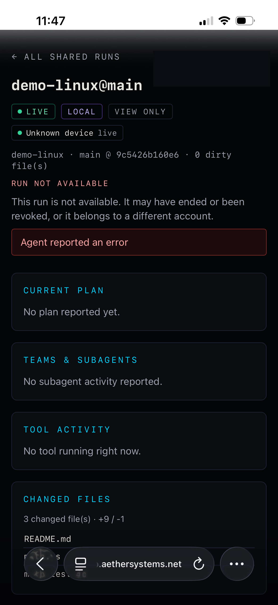
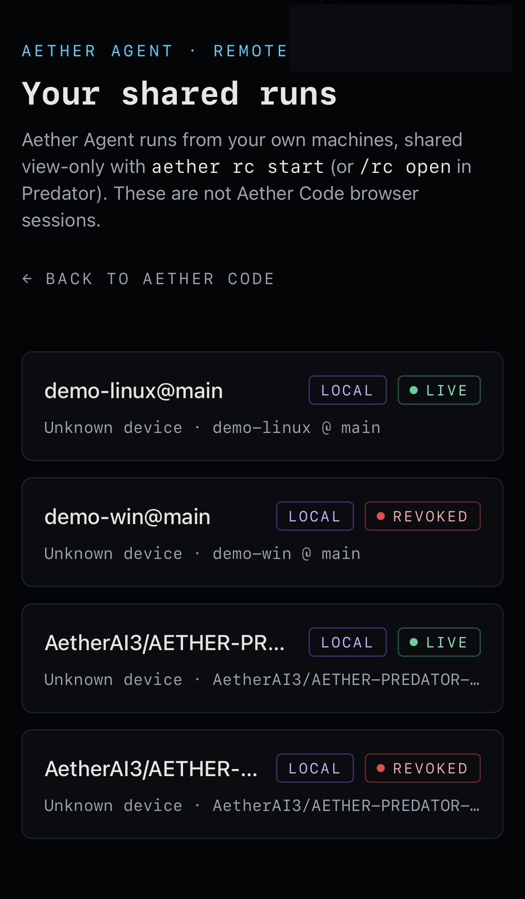

# RC deployed journey — live evidence (aether-agent#229)

Run 2026-10-06 14:00–15:48 UTC by the owner (phone + approvals) with an operator session driving both hosts.
Template credit: draft gate by the #225 lane. Every row below is a live observation unless marked otherwise.

## 1. Exact revisions

| Surface | Identity | How read |
|---|---|---|
| Agent (both hosts) | PR #292 head `2ab15dda14675c4794f80ccb3d5f2cbe028b7199`, packed `aether-agents-0.4.0.tgz` sha256 `e758b4db8634a3451ca537ee408072e3ce79e9fc2ccdc076eacd08b0b63bfa41` (built once on the Linux host from `git archive`, same bytes installed on both hosts in isolated prefixes; NOT the npm `0.4.0` package, which is `3cf3f725`) | `sha256sum` on both hosts |
| Cloud API | `3543d1d1` (journey start) → `9bc8bc92` (after the CORS fix, AETHER-CLOUD#1936) | `GET /cloud/healthz` `sha` |
| Aether Code web | `3543d1d1:site` (tree `75f2818c`), Vercel production deployment | `/.well-known/aether-release.json` marker (`/api/version` reads `unknown` for CLI deploys) |

## 2. Flags (account-scoped; API host env, backed up before change)

| Flag | Value |
|---|---|
| `AETHER_REMOTE_SESSION_USER_OVERRIDES` / `_VIEWER_USER_OVERRIDES` | owner account + second account = true (app user ids) |
| `AETHER_REMOTE_SESSION_BROWSER/_CONTROL_*` | unchanged (owner not enabled) |
| Web build | viewer + control + browser compiled ON; viewer bundle still scans clean (control lives only on `/rc-operator`) |

## 3. Hosts and accounts

| Role | Identity |
|---|---|
| Owner | owner account — host logins, phone |
| Second account (flags ON, not owner) | separate account of the same operator |
| Third account (flags OFF) | separate account of the same operator |
| Windows host | Windows 10 workstation, Node 24.18 |
| Linux host | Ubuntu server (Node 24.21) |
| Phone | iPhone, system browser |

## 4. Journey

| # | Step | Windows | Linux |
|---|---|---|---|
| J1 | Enroll | PASS `aether device enroll` → enrolled | PASS |
| J2 | Start RC | PASS exit 0, `host_state active`, acked 3 | PASS exit 0, acked 3 |
| J3 | Scan QR on phone | PASS owner confirmed "stream connected" | PASS "connected and live" |
| J4 | Live coding events | PASS 14 events (tool_activity, tests, diff_summary, done, error) stored and rendered; local brain (`--local`, see Gaps) | PASS real file change: diff `3 files +9/−1 README.md, math.js, math.test.js`, tests `verified` ×2 — owner confirmed on phone (screenshot) |
| J5 | Exposure / viewers | PASS `rc viewers` 1/8 then 2/8 from Cloud status route; `rc status` live/offline truthful | PASS status `host_reconnecting` after run (honest) |
| J6 | Revoke | PASS `rc off` exit 0, Cloud `state=revoked 15:36:21Z`, `rc link` refused, phone stream ended | PASS `revoked 15:47:42Z`, phone "Run not available" (screenshot) |

## 5. Properties

| # | Property | Result |
|---|---|---|
| P1 | Owner/device binding | PASS second account with RC flags ON: `GET /remote/sessions` 200 but `POST /remote/grants/redeem` **404** (uniform "invitation can't be opened"); flags-OFF account: 403, same uniform page |
| P2 | No inbound host listener | PASS host process mid-run: no LISTEN sockets |
| P3 | Outbound TLS only | PASS only `104.21.2.54:443` (api.aethersystems.net) + local Ollama `127.0.0.1:11434` |
| P4 | Redaction canary | PASS prompt canary `CANARY_RC229_PROMPT_*` absent from all 21 stored events (both sessions) |
| P5 | Event allowlist | PASS stored types ⊆ {session, presence, diff_summary, error, tests, tool_activity, done} ⊂ viewer profile |
| P6 | Duplicate-safe reconnect | FAIL→FIXED→PASS: reconnect preflight `400 Disallowed CORS headers` (`Last-Event-ID`) → AETHER-CLOUD#1936 deployed → `OPTIONS /observe 200`, 3 reconnects `GET /observe 200`, seq 10→14 contiguous, no duplicates |
| P7 | Broker outage, local run continues | NOT LIVE — covered by `rc_pump` virtual-clock 90 s outage tests only |
| P8 | No browser tool authority | PASS live anonymous scan of app.aethersystems.net: 16 chunks, 0 findings; phone page shows VIEW ONLY, no inputs |
| P9 | Disabled vs unavailable vs healthy | PARTIAL: disabled (flags-off account → 403) and healthy observed live; "unavailable" observed only via the CORS failure ("Stream unavailable"), not a deliberate outage |
| P10 | QR handoff across sign-in | PASS `npm run test:e2e:rc` 6/6 at the web revision; live phone sign-in via in-page button worked |

## 6. Gaps found (filed as issues)

- `aether rc start` requires `aether device enroll`, which Cloud allows only for `is_dev` operator accounts with Supercluster objectives/invocation/continuity flags → RC is unusable for ordinary accounts.
- Cloud `aether code` (agent dev sessions) is off in prod and `AETHER_AGENT_DEV_ENABLED` has no per-account override → journey used the local brain.
- Agent does not publish `plan` (host stages) nor tool completion (`tool_activity` only `started`).
- Viewer: stale error banner across turns; LIVE badges after revoke; "Unknown device"; stale dirty-file count; phone header account chip (fixed on `codex/rc-header-signin-return`, not deployed).
- Host keys were first approved under a third account that happened to be signed in → revoked and redone; device-flow approval page should show which account approves.

## 7. Phone screenshots (owner's iPhone; account chip redacted)

| Linux session after revoke (J4 diff + J6) | Shared runs list (#228 copy, revoked state) |
|---|---|
|  |  |

The left shot shows the measured diff (`3 changed file(s) · +9 / -1`) and "Run not available" after
`aether rc off`; it also shows two viewer bugs tracked in AETHER-CLOUD#1938 (header still LIVE, stale
error banner). The right shot shows the observer-only copy ("These are not Aether Code browser sessions").

## 8. Follow-ups

| Issue | Gap |
|---|---|
| #300 | `aether rc start` needs operator-only `aether device enroll` |
| #301 | No `plan` events from host stages; `tool_activity` never completes |
| #302 | Delivery edge cases (sync git at run end, cross-process lock, concurrent start, poison batch) |
| #303 | `release:truth` fails after `aether-agents@0.4.0` was published |
| AETHER-CLOUD#1938 | Viewer: stale error banner, LIVE after revoke, Unknown device, stale dirty count |
| AETHER-CLOUD#1939 | Agent dev sessions have no per-account override |
| AETHER-CLOUD#1940 | Heartbeat renews lapsed sessions; no expiry reaper |
| AETHER-CLOUD#1941 | Device-flow approval page should show the approving account |
| — | P7 (broker outage while the local run continues) not exercised live |

## 9. Rollback

1. `aether rc off` on each host (done; both sessions revoked).
2. Remove the two accounts from the RC `*_USER_OVERRIDES` on the API host (restore the pre-journey env backup), restart the API.
3. Site: promote the previous Vercel production deployment.
4. API: `deploy.sh` rollback pair (`.last-deployed-sha`).
