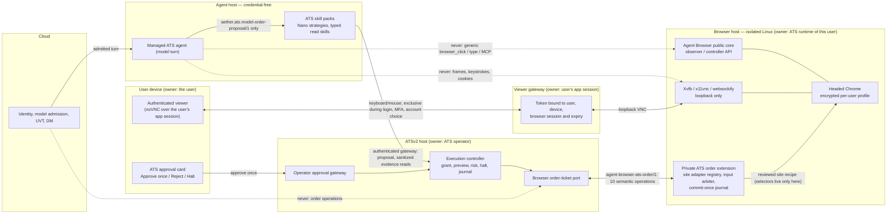
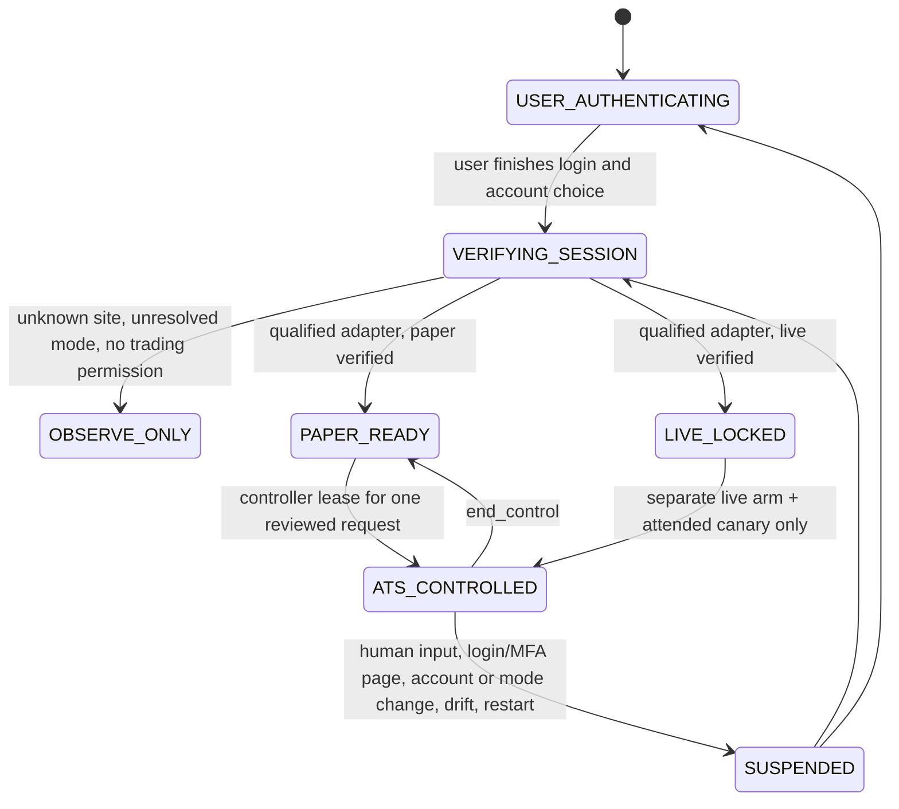

# ATS skill packs → Agent Browser → paper and live orders

**Status:** remaining implementation specification and P0 decision record, 2026-09-23 UTC. **This document authorizes no order.**
**Baseline:** Aether-Agent main `a8f066167dbfb816617d9bc99390d9319ece04cb` (merge of [#163](https://github.com/AetherAI3/Aether-Agent/pull/163)); ATSv2 main `32eb3aa2ffea71b9d3d910e5d2abf778b5d05cc3` (merge of ATSv2 #443); Agent Browser `v0.2.2` = `9981040b2e873b4120d0bc57850cbbb917603708`.
**Open, not merged:** [#162](https://github.com/AetherAI3/Aether-Agent/pull/162) (paper and live completion gates). Nothing below treats its provider-API-only live routing as an executable contract; section 7 lists what this document supersedes.
**Contract frozen here:** `agent-browser-ats-order/1` — [CONTRACTS.md section 4](../CONTRACTS.md).

## 1. Goal and product rule

A user opens Agent Browser's viewer, signs in to their own trading site and selects an account there. Their managed ATS agent uses ATS skill packs to analyze markets and propose trades. A deterministic ATS controller checks each bounded order, executes it through the same authenticated browser session, and verifies the result in the site's own order history. **Paper account first; live only after a separate arm and one attended canary.**

- **No broker picker, broker API key form, desktop application or up-front broker decision.** The signed-in site and account determine the candidate target.
- **A site-specific order adapter must still be qualified** for that site. That is an engineering compatibility requirement, not a user setup step. Unknown or unsupported sites stay **observation-only**.
- **No broker API integration is a prerequisite** for either milestone, provided the site's UI yields reliable order and reconciliation evidence. If it does not, that site's adapter is ineligible until another verifiable channel exists.

## 2. What exists today (verified at the baseline above)

| Component | Available now | Missing for this path |
|---|---|---|
| Agent #163 / ATSv2 #443 | Doctor separates activation from order readiness; closed `aether.ats.model-order-proposal/1`; pinned TS/Python fixture conformance | Host/runtime/tool invocation; translation into ATSv2's native intent |
| ATS skill package (`packages/ats-skills`) | Nano compilation, starter strategies, memory, journal, read-only `aether_browser_observe` | Admission into the managed agent runtime, activation against live evidence, an execution path with no raw browser controls |
| ATSv2 skills | Chart, market, risk, flow and journal building blocks | Fresh, source-attributed evidence per proposal; honest labels for research-only inputs |
| Agent Browser v0.2.2 | One headed Chrome shared with a loopback noVNC; HTTP API with observer/controller tokens; navigate/snapshot/interact; nine generic MCP tools | See 2.1 |
| ATSv2 execution controller | Structured intent, grant/risk machinery, bounded broker ports | A reviewed browser order-ticket port; the controller currently **excludes** visual/browser execution (see section 7) |
| AetherATS chart-browser/v1 | Separate chart observer; operator cancel/flatten endpoints behind their own key | Reusable isolation ideas only; it is not a same-session order adapter or submit route |

**Truthful status:** ATSv2's paper broker writes *simulated* fills locally; that is not a trading site's paper account. The generic Agent Browser can click but has no trade-specific authorization or order confirmation. Neither proves browser paper or live trading.

### 2.1 Agent Browser facts that shape the contract

Read from `AetherAI3/agent-browser@9981040`:

- **The public core excludes trading.** Its README places ATS/trading integrations, broker or account selectors, order actions, secrets and credential injection outside the public core. The site adapter therefore ships as a **private extension on the browser host**, not as a change to the public project.
- **No lease, owner or takeover signal.** x11vnc runs `-shared -nopw`; human input goes straight to the display and nothing preempts the API caller. Any caller with the controller token and session UUID can act.
- **No session generation beyond the UUID, and the profile is temporary.** Each session gets a fresh profile directory that is deleted on end; a signed-in login would not survive.
- **No origin allowlist and no navigation-drift detection.** Navigation policy only blocks private and reserved addresses.
- **noVNC is unauthenticated and loopback-only by design.** A remote viewer is a new access-control feature, never a port-forward.
- **Chrome is not pinned.** Each image build installs the then-current Chrome Stable; v0.2.2 recorded 152.0.7977.82.
- **Budgets likely to break a real broker site:** 16 DNS resolutions, 32 navigations and one page per session, with iframe navigations blocked (inferred from the code, not measured).

Each of these is a P1/P3 prerequisite. The contract pins the fields they must produce — session generation, control holder and verified origin — so they cannot be skipped.

## 3. Architecture: one browser session, four owners

**Capability boundaries.**

1. **The model** sees typed, sanitized evidence and can emit only the closed proposal. It has no browser, VNC, MCP or order-operation channel.
2. **The ATSv2 controller** alone speaks `agent-browser-ats-order/1`. It never receives raw VNC, keystrokes, cookies, passwords or login/MFA/account-page frames.
3. **The private extension** is the only code that knows selectors. Its recipe is pinned by `adapter_digest`; the contract carries no selector, coordinate, URL, script or free text.
4. **The human** owns login, MFA, account choice and approval. Human input on the viewer preempts ATS control immediately.
5. **Cloud** admits model turns and meters UVT. Cloud admission is never trade authority; only ATSv2 grants it.
6. **E1** `ats_workspace_status` and the later order capability are separate capabilities on separate leases.

**Deployment decision (P0).**

- **Browser host:** Agent Browser on an isolated Linux host. Image pinned by digest, Chrome version recorded per build, and the private extension installed beside it.
- **Controller host:** ATSv2 on the enrolled operator host.
- **Agent host:** credential-free.
- **Viewer:** an authenticated gateway owned by the user's application session. Browser profile and raw VNC never leave the browser host.
- **Host record** — every qualification run records `{image digest, Chrome version, extension version and digest, adapter id/version/digest, browser host id, user_ref, agent_id}`.
- **Windows** — the existing Windows client talking to a Linux browser host does not create a safe Windows viewer; that remains unqualified.

## 4. Session lifecycle

`verify_session` reports what the adapter sees; ATSv2 derives the state with `deriveBrowserBindingState()`:

- **Login screens** carry no account data and leave control with the user.
- **Paper is proven** only by a site-specific positive indicator plus a second independent indicator wherever the adapter has one. An absent or contradicting second indicator leaves the mode unresolved, which means observe-only.
- **Live is always `live_locked`** from the browser's side. A signed-in live session never enables an order.

On authentication, MFA, account switch, mode flip, browser restart or profile change, the browser host rotates `session_generation`. That blanks model observation, revokes the controller lease and expires every review and live arm minted under the old generation.

## 5. The frozen contract in one page

`agent-browser-ats-order/1` has two closed documents: `aether.ats.browser-order-call/1` and `aether.ats.browser-order-result/1`. TypeScript modules: `src/core/ats_contracts/browser_order.ts` (call), `browser_order_result.ts` (result) and `browser_order_gate.ts` (decisions). Golden vectors: `test/fixtures/ats_browser_order_golden.json`. Independent Python mirror: `test/fixtures/ats_browser_order_wire.py` and `ats_browser_order_gate.py`, exercised by `ats_browser_order_verify.py` in CI on Linux and Windows.

| Operation | Effect | Binding | What it returns |
|---|---|---|---|
| `verify_session` | observe | optional (discovery) | session state, bare https origin, account fingerprint, masked label, two-indicator mode evidence, trading permission, control holder |
| `read_market` | observe | required | bid/ask/last in minor units, quote time, `account_executable` or `display_only` |
| `read_account` | observe | required | fingerprint, mode, cash and buying power in minor units |
| `prepare_ticket` | prepare | required | the rendered ticket read back, plus its digest; nothing submitted |
| `verify_ticket` | observe | required | the rendered ticket read back again immediately before commit |
| `commit_once` | mutate | required | `confirmed` with the site order id, or `site_rejected`; never a fill |
| `read_order` | observe | required | the account and mode read from, plus order status and fills from `order_history` or `order_detail` only |
| `read_positions` | observe | required | signed whole-share equity positions from the positions view, plus a count of holdings the contract cannot represent |
| `cancel_order` | mutate | required | the account and mode, then `cancel_confirmed` or `already_final` |
| `end_control` | release | optional | control back to the user |

Every call carries: user/agent/browser session and `session_generation`, the adapter id/version/digest, the ATSv2 request id, a unique call id, `issued_at`, and a deadline. The deadline window is at most 120 s, and at most 30 s for the two mutations. Every result echoes that identity. `verifyBrowserResult()` refuses an answer when any of these holds:

- it answers another call;
- it comes from another session generation or principal;
- it comes from a changed adapter;
- it was observed more than 5 s before the call was issued (a replayed or cached answer);
- it disagrees with the binding or parameters;
- it is a read observed after its deadline.

A mutation's outcome is a fact about the site and is never discarded for lateness. **A refused mutation promises that nothing was dispatched.** Anything the adapter cannot promise that about is `ambiguous`, which always requires reconciliation and never permits another click. Two consequences follow:

- When the gate refuses an answer to a mutation, ATSv2 treats that mutation as `ambiguous`.
- A `duplicate_commit` refusal also requires reconciliation, because it proves an earlier commit for the request exists.

Labels come from a closed character set and tickers are equity-shaped, so neither fullwidth digits nor an all-caps URL can pass as data.

## 6. Implementation work in dependency order

### P0 — lock the architecture and the wire (this change)

- [x] **Baseline pinned.** #163 and ATSv2 #443 are merged foundations, pinned above. #162 remains open and non-executable.
- [x] **`agent-browser-ats-order/1` frozen** in TypeScript with 189 single-cause golden vectors:
  - 28 faithful exchanges covering every operation;
  - 69 call rejects, including unknown operations and injected selectors, coordinates, URLs (a URL-shaped ticker among them), scripts, free text and authority;
  - 58 result rejects, including page text, screenshots, cookies, account numbers, fullwidth digits, confusable and direction-override labels, toast evidence and fills claimed by a commit;
  - 34 gate mismatches, including a changed adapter digest or version, session generation, principal, binding, ticket field, symbol, order reference, stale reads and replayed answers.
- [x] **Independent Python mirror** reproduces all vectors with byte-identical digests and refusal messages. The fixture also carries vectors for the Python/JavaScript traps: `$` before a newline, Unicode `\d`, UTF-16 length, and V8's timestamp classes, including year 0000. A differential probe of 37 timestamp edge cases agreed on every message and millisecond.
- [x] **Independent reviews**, covering TypeScript, security and Python parity. The security review found a fullwidth-digit label bypass and a URL-shaped ticker; the TypeScript review found a replay gap; the Python review found a year-0000 divergence. All are fixed and pinned by vectors. The same label and ticker weaknesses in the frozen Spec 1 shapes need a versioned change and are tracked separately.
- [x] **Guards verified by breaking them.** Removing each of 24 guards in either language fails the suites for the stated reason. So do a corrupted digest, eroded coverage and a wrong stated reason.
- [x] **Diagram and deployment decision** — sections 3 and 4.
- [x] **No order tool exists.** The module performs no I/O and nothing registers these operations as a tool.
- [ ] **ATSv2 companion.** Lift the Python validators into `ats-mcp`, pin the fixture file digest, and extend `ats-mcp.yml`'s Agent SHA, `cmp` and runpy lists.

**Gate:** protocol fixtures fail on any unknown action or field or a changed adapter digest, in both languages. No order tool is available.

### P1 — managed host and same-session login handoff

- Complete Agent's signed ATS runtime: source, anchor, archive fetch/extraction, launcher and authenticated probe. Bring up Cloud's enrolled local tool host with durable invocation/result custody and one same-DM E1 status call.
- Provision the authenticated viewer gateway. The viewer token is bound to user, device, browser session and expiry, and refuses replay, the wrong user and the wrong session.
- In the private extension, add:
  - an **input arbiter** that detects human viewer input and preempts the controller lease;
  - **session generation** rotation;
  - a **persistent encrypted per-user profile**, only when explicitly enabled, with **Forget session**;
  - **origin allowlisting** per adapter;
  - **navigation and tab drift** detection.
- **Gate:** the user logs in over the protected viewer, and ATS observes an allowlisted chart after handoff. ATS cannot see login, MFA or account screens and cannot issue an order. An account switch or human takeover stops ATS control immediately.

### P2 — ATS skill packs as the trading brain

- Sync the canonical skill package with a pinned digest, and register it on the managed ATS host. Activate the compiled Nano strategy with a native receipt, strategy/version/source digest and signal inventory. The six starter strategies are examples, not proof of a signal.
- Build typed read skills that emit fresh, sanitized, source-attributed evidence: timestamps, symbol, session/account binding, feed rights and price source. A site quote is executable evidence only when its adapter proves `account_executable` for that account.
- Translate the closed proposal into ATSv2's native intent inside the authenticated gateway. ATSv2 fills in account, environment, client, grant, evidence refs and activation from server state. Invalid translation refuses with a typed error.
- **Gate:** one same-DM model turn reads one fresh evidence packet and yields one reviewed proposal with no browser mutation. Restart, stale feed, wrong symbol and a changed strategy digest refuse preview.

### P3 — qualified browser order skill and ATSv2 port

- **Site adapter registry** of reviewed code: pinned origin, two-indicator paper/live detectors, keyed account fingerprint, ticket fields, submission confirmation, order-history lookup, cancel/flatten.
  - Detection happens after sign-in; there is no up-front picker.
  - Unknown, changed or unsupported UI means observe-only.
- **ATSv2 browser order-ticket port** as a reviewed replacement for the API-only commit requirement (section 7). It must carry equivalent risk, account, idempotency and receipt checks, and it is never a pass-through to generic browser MCP tools.
- **Commit flow:** `prepare_ticket` → `verify_ticket` → compare with the immutable preview and approval → `commit_once`.
  - Serialize under a per-account lock and journal `COMMITTING` before dispatch.
  - Never repeat a possibly delivered click.
  - Reconcile the site order id, status, fills and position from a refreshed order-history read. A toast or screenshot is never a fill receipt.
- **Paper and live bindings are separate:** distinct browser profiles, account fingerprints, grants and adapter modes. Sign-out, mode flip, drift, site update, takeover or an unreconciled order revokes execution capability.
- **Gate:** deterministic fixture pages and an approved real paper site both pass:
  - field mismatch, malicious page text and changed selector;
  - duplicate click, timeout after click and partial fill;
  - account flip, halt/cancel and restart.

  Neither the model nor Cloud credentials can reach `commit_once` or the approval gateway.

### P4 — paper account end to end

- **Setup.** The operator signs in to a real non-live paper account over the viewer and sees **PAPER verified** on an ATS card.
- **Grant.** One narrow paper grant: one agent, one account, one symbol, tight quantity/notional/daily caps and a short expiry. The native strategy and evidence must match.
- **Order path.** Propose → review → approve once → prepare/compare/commit → reopen order history → reconcile order id, status, fills and position.
- **Receipt.** An opaque receipt stores the code, adapter, session, grant, approval and review ids.
- **Failure paths.** Exercise refusal, cancel and unknown outcome.
- **Paper GO:**
  - one site-confirmed paper order;
  - one matching reconciled position;
  - zero duplicate submits after restart or timeout;
  - a passing cross-account/route-tamper test.

  A simulated ATS paper fill never passes this gate.

### P5 — separately gated live execution

- **Separate binding.** Recognize the live account in the same flow, but mint a new live binding and an expiring arm. The human reviews the exact live account fingerprint and numeric limits.
- **Hard limits.** One instrument and order type, minimum practical exposure, no leverage/short opening/options, hard daily and position caps, market-hours and fresh-price checks.
- **Rehearsal before any order.**
  - Read-only live account/quote/orders/positions first.
  - Dry-run ticket preparation with submit disabled.
  - Adversarial browser-state and viewer-takeover tests.
  - Pause, Lock, Cancel, Flatten and End session proven — or shown unavailable, which blocks live.
- **Attended canary.** One separately authorized, operator-attended, minimum-size live order: human approval of the exact preview and rendered ticket, then reconciliation. Automated live mode stays disabled pending a later explicit decision.
- **Live GO:**
  - a signed exact-head release record;
  - paper proof and live account/mode proof;
  - hard caps and a working stop/cancel path;
  - one reconciled attended canary.

  Any unknown outcome, wrong account, UI drift, missing price rights or unmatched fill returns **HOLD / NO NEW LIVE ORDERS**.

## 7. Supersession of API-only language

For the Agent Browser mission, the following statements are superseded. Everything they forbid about generic browser control still stands.

| Source | Statement | Replacement |
|---|---|---|
| #162 §1, destination 2; G7 | Provider sandbox/paper requires a separately integrated broker's documented API | A site paper account reached through a qualified adapter under `agent-browser-ats-order/1` is also a `provider_sandbox` route. No API is a prerequisite. |
| #162 G8 | "No browser clicks, VNC, raw agent shell, MCP pass-through or free-text order endpoint can be a fallback." | Generic clicks, raw VNC, raw shell, MCP pass-through and free-text endpoints stay forbidden. A reviewed site adapter executing the ten semantic operations under ATSv2's browser order-ticket port is a qualified **primary** route, not a fallback. |
| #162 §2 | A device/browser screenshot cannot authorize an order or verify a fill | **Unchanged.** Fills come only from `read_order` against a qualified history surface. |
| ATSv2 `llmre/execution_controller.py` L21-22, L32-34, L235, L1101-1102 | Production commits must use the broker-API port; no browser/VNC/OCR/pixel state may authorize, price, verify or submit | Replaced in P3 by a reviewed browser order-ticket port with equivalent evidence. Its evidence is typed contract data, never pixels. Unchanged until then. |
| ATSv2 `llmre/execution_controller.py` L1118-1125 | A commit exception or unknown status becomes `rejected` | Must become `ambiguous` with reconciliation for any browser commit that may have been dispatched (P3). |
| ATSv2 `docs/CHART_BROWSER_SECURITY.md` L3, L25-26 | Claims ATS places live orders through a chart controller "ticket port" | Stale against the current controller. The chart adapter stays chart-only; the order ticket is a separate adapter. |

The execution-foundation checkpoint's gate 4, "choose and qualify an external sandbox adapter separately", is satisfied on this path by a qualified browser site adapter rather than an API adapter.

## 8. Failure and evidence rules

| Event | Required behavior |
|---|---|
| Human input on the viewer, or a login/MFA/account page appears | ATS input and frame access stop; the pending review expires; the user keeps control |
| Site or adapter change, browser restart, account or mode change | New `session_generation`; reverify; existing reviews and any live arm expire |
| Click may have reached Submit but the reply timed out | `ambiguous`; never click again; locate the order by request reference and history, or stay unresolved and halt new orders |
| Duplicate model call, approval or receipt delivery | Return the saved review or outcome; approval consumed once; browser commit at most once per request |
| Only a chart, toast or simulated ATS journal shows success | Report unverified or "ATS simulated paper"; never claim a site fill |
| User halts, model quota expires, or Cloud/ATS host is down | An independent operator route keeps halt, order lookup, cancel/flatten and reconciliation available |

Browser snapshots, account details and login material stay out of the DM, model context, diagnostic journal and release packet. A release packet keeps:

- the opaque account ref and environment;
- exact code, adapter and browser digests;
- grant, approval and review ids;
- the site order id where safe;
- timestamps;
- extracted ticket-field proof;
- the reconcile result.

Redacted screenshots, when necessary, belong only in restricted operator storage.

## 9. PR train

| # | Repositories | Deliverable and merge gate |
|---|---|---|
| 1 | Aether-Agent + ATSv2 | This contract, TS/Python negative fixtures, supersession of API-only language. The closed proposal stays model-facing; the order operations are ATS-only. |
| 2 | Aether-Agent + AETHER-CLOUD | Signed host activation, E1 invocation and same-DM receipt; no order capability on E1 |
| 3 | agent-browser (private extension) + host gateway | Authenticated viewer, takeover/login fence, user/session binding, protected persistent session, typed ATS capability; no publicly routed raw VNC |
| 4 | ATSv2 + Aether-Agent | Skill-pack activation, sanitized evidence, proposal translation, target/session/grant/preview/approval cards; review-only canary |
| 5 | agent-browser (private extension) + ATSv2 | One qualified site adapter, ATSv2 browser order-ticket port, journaled commit-once, history reconciliation, operator stop/cancel; paper tests and canary |
| 6 | ATSv2 + Aether-Agent + Cloud | Separate live arm, read-only live proof, exact-head adversarial review, one founder-authorized attended live canary and rollback receipt |

**Milestone 1:** a user-signed-in paper account receives one ATS-generated order through Agent Browser, with the site's own order id and a matching position.

**Milestone 2:** the same path under a separate live arm and one attended minimum-size order.
