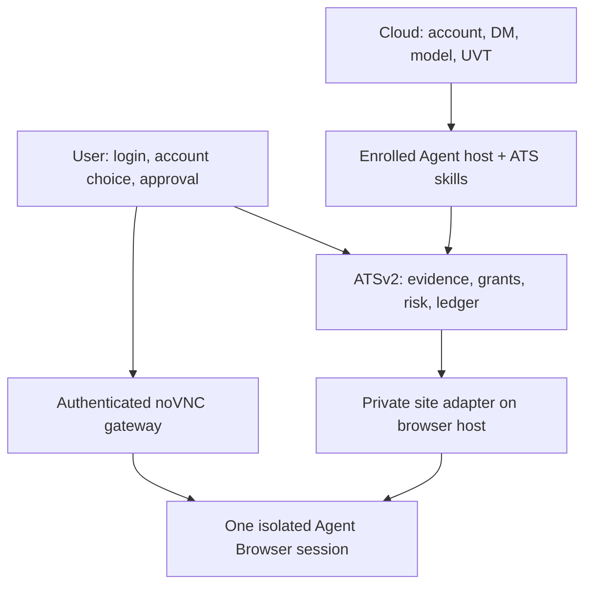

# Aether ATS → Agent Browser execution: remaining gates (V2)

**Date:** 2026-09-23 UTC  
**Status:** implementation specification. No paper or live order is authorized by this document.  
**Product goal:** A user opens an authenticated Agent Browser noVNC view, signs in to a trading site and chooses an account there. Their managed ATS agent uses ATS skill packs to propose a trade. ATSv2 checks and, after a separate human approval, executes a bounded order through **that same browser session**, then reconciles against the site's order history. Qualify a site paper account before considering live capital.

This V2 is the current delivery map after Aether-Agent [#159–#164](https://github.com/AetherAI3/Aether-Agent/pull/164), ATSv2 [#441](https://github.com/AetherAI3/ATSv2/pull/441), [#443](https://github.com/AetherAI3/ATSv2/pull/443), [#444](https://github.com/AetherAI3/ATSv2/pull/444), AETHER-CLOUD [#1691](https://github.com/AetherAI3/AETHER-CLOUD/pull/1691) and [#1700](https://github.com/AetherAI3/AETHER-CLOUD/pull/1700) merged. The source README status correction [Agent #165](https://github.com/AetherAI3/Aether-Agent/pull/165) also merged. It supersedes the provider-API-only execution route in the older completion spec **for this Agent Browser mission**. A broker picker, broker API key form and desktop trading app are not prerequisites. A site-specific adapter is still mandatory engineering work; an unknown site remains observe-only.

## 1. Current truth and the first usable milestone

| Surface | On main | Still missing |
| --- | --- | --- |
| Managed ATS agent and Cloud | Account-scoped draft/setup and Online DM; Cloud has bounded `browser_observe` for approved ATS revisions. | A production enrolled host with one durable same-DM E1 status call; read evidence and proposal delivery to ATSv2. Cloud observation grants no browser control. |
| ATS skill packs | Native Nano scan/compile, six starter sources and a larger pinned corpus, local memory and writer lease, bounded journal and read-only browser skill. | Admit the skills to the actual managed runtime; native strategy activation, executable signal inventory and fresh account-bound evidence. |
| Agent runtime | Signed manifest, slots, supervision and `/ats doctor/2` verification framework. | Published independent signing anchor, entitled source, signed artifact format/fetch, confined extraction selected in production, launcher, authenticated probe and lifecycle deployment. The default installer says transport unavailable. |
| Order authority | Closed model-order proposal and Agent/ATSv2 mirrored `agent-browser-ats-order/1`; 189 cross-language vectors. | Authenticated translation into ATSv2 native intent, enrolled target, grant, preview, approval, browser ticket port and reconciliation. Validators register no order tool. |
| Agent Browser | One headed Linux Chrome session with snapshots and loopback noVNC. | Authenticated user viewer, input takeover detection, owner/session generation, profile custody, allowed origins and a private qualified trading-site adapter. Public noVNC is unauthenticated and must remain loopback-only. |
| ATSv2 | Risk/grant/operator machinery and a separate **ATS simulated paper** journal. | Browser-order port and site-backed evidence; the simulator cannot prove a trading-site paper order. |
| Package release | Aether-Agent source is `0.4.0`; npm `aether-agents@latest` was `0.3.2` at audit. | Final exact-head release canaries, release packet and protected publish. Source version is already bumped; registry publication is separate. |

A local check on the merged Agent code passed 101 relevant tests, reproduced 189 browser-order vectors in independent Python, and passed package verification at 4,844,612 / 5,000,000 unpacked bytes. A clean `/ats doctor/2` reported `paper_order_ready=false`, `provider_sandbox_ready=false`, `broker_live_ready=false`. No noVNC service was reachable in that workspace; these results **do not** constitute a deployed viewer or order smoke.

**First product milestone:** One ATS-generated order in a real site's **paper account** selected within noVNC, with a site order ID and matching order-history/position evidence. **Second milestone:** one separately authorized, attended, minimum-size live order after the paper proof. No model, installer, saved browser login or paper approval can arm the second milestone.

## 2. Ownership and transport

- **User** owns login, MFA, account choice, session takeover and a separate operator approval. A model may propose; only the authenticated human may approve.
- **Cloud** admits model turns, applies UVT, owns the DM and invokes only registered host tools. Its E1 `ats_workspace_status` is read-only. Cloud credentials never carry a `commit_once` capability and UVT admission never grants trading authority.
- **Agent host** holds the credential-free managed-agent runtime, exact ATS skill-pack digest, Nano activation receipt and sanitized model evidence. It cannot select an account from text or call generic browser click/type on a trading page.
- **ATSv2** owns target binding, grant, executable quote requirements, risk, immutable preview, reservation, separate operator session, approval consumption, order ledger, halt and reconciliation. It alone may invoke the ten typed browser-order operations.
- **Browser host** runs the private site adapter beside the same Chrome session the user sees. Selectors and site-specific recipes exist only here. It stores no model prompt or ATS grant authority.
- **Viewer gateway** authenticates the user before bridging to host-local noVNC. The raw `127.0.0.1:6080` noVNC and `127.0.0.1:5900` VNC ports are never reverse-proxied, tunneled or published directly. The current generic browser API's observer/controller tokens do not constitute user authentication for the viewer.

The browser execution wire is the already frozen `agent-browser-ats-order/1`: `verify_session`, `read_market`, `read_account`, `prepare_ticket`, `verify_ticket`, `commit_once`, `read_order`, `read_positions`, `cancel_order`, `end_control`. Calls and results are closed documents bound to user, agent, browser session and generation, ATS request/call IDs, adapter ID/version/digest, deadline and, once discovered, an ATS-minted account binding. No selector, coordinate, URL, script, free-text action, cookie, screenshot or password is expressible there. Do not widen this `/1` wire silently: version any necessary change and regenerate TS/Python fixtures.

The **model-facing** `aether.ats.model-order-proposal/1` contains no account, environment, grant, approval, client or request ID. An authenticated ATS gateway maps the proposal to server-owned state. It refuses on symbol, strategy digest, environment, evidence or owner mismatch.

## 3. Session and UI contract

### 3.1 Same-session login

The app presents **Open trading browser** from the managed ATS agent. It mints a short-lived viewer grant tied to authenticated user, agent, browser-host instance, browser session ID, session generation and expiry. The gateway checks the app session on the initial request **and WebSocket upgrade**; reject cross-origin use, replay, a second owner and mismatched session. It never includes a reusable viewer or controller token in a shareable URL. Disconnect, logout or revocation invalidate the grant. The host-facing viewer connection remains private.

User input has exclusive control through sign-in, MFA and account selection. During this state the ATS observer and order controller receive neither frames nor page text, and no input can be queued for later replay. The user presses **Hand back to ATS**. A read-only, site-specific verifier checks exact HTTPS origin, signed-in state, opaque account fingerprint, masked label, trading permission and site mode. A visible label by itself is insufficient; require a positive paper/live indicator and a second independent site signal when available. Missing or contradictory evidence gives `OBSERVE_ONLY`, never a guessed paper account.

The first supported site is chosen by engineering **after observing which site the user signs in to**. Qualification is per site and adapter version; there is no up-front broker-selection product flow. Unsupported sites can be observed within the allowed policy but cannot show an order approval or submit control.

### 3.2 Takeover, persistence and rotation

The private browser extension needs an input arbiter, not merely a viewer overlay. Any human keyboard/mouse input, login/MFA page, account switch, mode flip, origin/tab drift, profile restore, browser restart or changed adapter digest revokes ATS control synchronously. Rotate `session_generation`, blank model observation and expire pending previews, approvals and live arms. Do not give control back automatically after a quiet interval; require fresh verification and handback.

Agent Browser v0.x creates a temporary one-session profile and has no authenticated remote noVNC, input preemption or persistent session ownership. Implement encrypted per-user browser profile persistence only as an explicit option, with bounded retention and **Forget session**. Never copy cookies, page HTML or screenshots into Cloud DM or Agent journals. A restored profile is `VERIFYING_SESSION`, not `PAPER_READY`.

The generic runtime's existing one-page, DNS/navigation and iframe limits may prevent real trading sites from loading. Measure one candidate site under its exact image/Chrome digest and introduce bounded **adapter-scoped** allowances with tests; do not globally weaken SSRF, egress or navigation protections.

### 3.3 User-visible states

| UI state | What the user sees | Permitted action |
| --- | --- | --- |
| Sign in privately | Browser and clear “you have control” indicator | User login/MFA/account choice; ATS sees no sensitive frame. |
| Observe only | Site/account unverified or unsupported reason | Read-only observation after privacy checks; no order card. |
| Paper verified | Masked site/account, PAPER, session age and qualified adapter | ATS proposal and review; order only under separate paper grant and human approval. |
| Live locked | Masked site/account, LIVE and lock reason | Read-only checks; no order until an independent live arm. |
| Review pending | Symbol, side, type, quantity, price rule, bounded exposure, strategy/evidence age, exact account and expiry | Human approves or rejects once in an ATS-authenticated card. |
| Reconciling/unknown | Last known site order ID if safe, exact uncertainty and current halt | Read order/history and operator actions; never offer “retry submit.” |
| Halted | Operator reason and available Stop, Cancel, End session controls | No new order. Cancel/flatten only if that site's independently qualified action exists. |

## 4. Work packages and acceptance gates

### G0 — contract and release baseline: DONE as foundation

Keep Agent #163/#164 and ATSv2 #443/#444's exact fixture digests pinned in cross-repo CI. Record their merge SHAs in the release matrix. Close the two identified older Spec-1 label/ticker weaknesses through a **versioned** change before reusing those shapes for an executable order; the new browser wire already fixes them. Keep the older API-only paper/live spec as historical context, with the Agent Browser route designated authoritative for this mission. A passing schema fixture means only that both sides agree on shapes and refusals.

**Evidence:** fresh cross-language fixture run, zero order tools registered and the current doctor refusal projection.

### G1 — real runtime and E1 host: BLOCKED

**Agent:** publish the entitled runtime manifest source and an independently pinned signing/rotation anchor; freeze an archive format and select a confined extractor that checks each entry **before writing**; fetch with bounded size/time and digest, stage inactive slot, fsync receipt, switch pointer, launch a pinned binary, then require an authenticated instance/capability probe. Supply production dependencies for `/ats runtime install|start|status|restart|rollback`. Imported or unverified installations cannot start. Test Linux and Windows packaging where claimed, process ownership/PID reuse, cancellation and rollback. Keep the writer lease for the entire native Context process lifetime.

**Cloud + Agent:** implement the enrolled, foreground local tool host from the E1 contract. Cloud issues a short lease to the exact owner/device/agent, persists call/result custody and returns one `ats_workspace_status` result to the **same DM**. Lost response, duplicate invocation, account switch, host crash and lease expiry must redeliver the stored result or fail closed; none may run an order. ATSv2's observer receipt supplies authenticated runtime truth.

**Gate G1:** one actual Cloud → enrolled host → ATSv2 status → same-DM call at an exact deployed commit, with a restart/replay receipt. A unit test, healthy droplet or successful package install is insufficient.

### G2 — authenticated viewer and private login: BLOCKED

**App + browser host:** implement the viewer gateway and private input arbiter from §3. Bind user/session/generation, short expiry and revocation; keep noVNC loopback-only. Pin host image and Chrome, isolate one user's browser/profile per worker, protect stored profile and add Forget session. Make human input an immediate lease revocation signal to ATSv2, not just a UI toggle. Verify origin, account/mode and adapter only after handback. ATS cannot observe login/MFA/account pages.

**Gate G2:** an operator logs into a real **paper** site through the authenticated noVNC view, sees the same browser in the Agent session card, and hands back to ATS for a sanitized read. Wrong user, replayed viewer grant, account flip, login takeover and browser restart all cut off ATS immediately. No order action is available.

### G3 — ATS skill packs and proposal: BLOCKED

**Agent + ATSv2:** register the pinned skill pack on the enrolled managed host. Activate a compiled Nano strategy natively and persist its strategy/source/version digest, required signal list and activation receipt. Bind market/chart/flow/risk/account reads to the verified browser session and ATS account generation. Each evidence record carries symbol, source, observation time, quote time, price units, feed rights, session/adapter digest, confidence limitations and a clear `research_only` versus `account_executable` label. Hostile page text remains untrusted and sanitized before model context; pixels and credentials do not enter durable DM or logs.

The model generates one closed proposal. The ATS gateway authenticates origin and fills in client, account/environment, grant, strategy activation and evidence references. Only ATSv2 decides preview eligibility. Missing or stale executable price, incomplete account inventory, symbol mismatch or unavailable feed rights refuse preview; no research chart can silently become an executable quote. Model retries cost and create no duplicate execution action.

**Gate G3:** one same-DM turn yields one previewable proposal with no browser mutation. Account switch, stale data, changed Nano digest, wrong owner and fake page instruction all fail closed.

### G4 — first site adapter and ATSv2 browser port: BLOCKED

**Private adapter beside Agent Browser:** version and digest one reviewed site recipe. Pin allowed origins, account-fingerprint derivation, independent mode indicators, ticket fields, submit confirmation, order-history and position selectors, cancel capability and observed UI fingerprint. The public OSS Agent Browser API stays generic; the private adapter is the only selector authority. Site update, unsupported order type, changed tab or ambiguous account means observe-only.

**ATSv2:** add a browser order-ticket port under the native controller. Do not pass generic browser MCP controls through the bridge. Map its `provider_sandbox` and `provider_live` bindings to the frozen paper/live browser modes; ATS-only simulated paper never reaches this port. Preserve existing risk, grants, quotas, halt and two-principal human approval. Review signs an immutable hash over account binding/generation, adapter, strategy, evidence, order fields, price rule, risk snapshot, expiry and operator identity. Right before mutation, recheck all of them and read the rendered ticket back.

The commit path is `prepare_ticket` → compare → human approve once → `verify_ticket` → compare again → durable `COMMITTING` record → `commit_once`. Hold a per-account/request serialization lease. A repeated request returns the original receipt. If the click **may** have reached Submit, timeout or lost response becomes `AMBIGUOUS`, never `REJECTED` and never another click. A `refused` mutation may be retried only when the adapter proves no action was dispatched; `duplicate_commit` goes to reconciliation. `commit_once` may return a site order ID but **never** a fill.

Reopen a qualified order-history/detail page for `read_order`, then `read_positions`. Accept filled/partial/working/cancelled only with matching account, mode, symbol and site order ID; record unrepresentable holdings and block new risk if the position view is incomplete. Reconciliation must work after process restart. The operator stop path remains available if Cloud/model/UVT is unavailable. If flatten is unsupported, mark it unavailable and block live qualification rather than improvising a generic click.

**Gate G4:** deterministic hostile fixture pages and one qualified real paper UI pass changed selector, bad origin, mode flip, stale quote, mismatched rendered ticket, malicious page text, two tabs, duplicate approval, concurrent commit, timeout after click, partial fill, site rejection, halt/cancel and restart. The model and Cloud credentials cannot invoke `commit_once`.

### G5 — real paper-account qualification: BLOCKED

The user signs in to a supported site's paper account in noVNC and selects it **there**. ATSv2 mints a short paper grant for one agent, one bound account, a small symbol/order-type allowlist, numerical size/notional/daily limits and expiry. A reviewer sees the exact PAPER label, masked account, order fields, worst-case exposure and the site adapter identity. After separate human approval, ATSv2 prepares/compares/commits once and reconciles from the site's order history and position view. Run one refusal and one cancel/unknown-outcome exercise without allowing a second submit.

**Paper GO requires all of:** site order ID; independently refreshed site status and position; matched account/mode; durable request/approval/adapter/session evidence; no duplicate after restart or timeout; working takeover/halt; passing cross-account and environment-tamper cases. An ATS simulated-paper journal entry, ticket toast, screenshot or successful HTTP response cannot substitute for any item. Until then the public status remains **PAPER HOLD**.

### G6 — separate live-capital qualification: HOLD

First observe and reconcile the user's selected live account in noVNC with **submit disabled**. Bind a new live account fingerprint, separate profile/session generation, expiring live arm and fresh grant. Human verifies numerical limits and the exact live account. Allow one instrument and one order type initially; cap quantity, notional, daily exposure and open positions; prohibit leverage, short opening and options by default; require market-hours and current account-executable pricing. Never derive live authority from a paper grant, permission preference, login or agent proposal.

Exercise live ticket preparation without submission, wrong-account and paper→live flip, UI drift, VNC takeover, restart, unknown status and stop/cancel/flatten availability. If required operator actions cannot be proved at this site, live stays on HOLD. Only after signed paper evidence, exact-head adversarial review, explicit owner authorization and a separate operator-attended approval may a **single minimum-size live canary** commit. Reconcile order ID, fills, open orders and position from the live site's history. Automated live remains disabled pending another release decision. The spec itself authorizes no live canary.

## 5. State, custody and failure semantics

| Event | Durable record and behavior |
| --- | --- |
| New browser session | Mint session generation and owner-bound viewer grant; no trading binding yet. |
| User login, MFA, account/mode switch or input | Revoke ATS control, rotate generation, blank observations and expire pending review. |
| Preview created | Freeze binding, adapter, source/evidence digests, risk and expiry; no browser mutation. |
| Human rejects/expires | Terminal refusal; consume or invalidate the pending approval; no submit. |
| Commit requested | Under per-account lock write `COMMITTING` **before** calling the adapter; consume approval once. |
| No-action refusal | Persist typed reason and proof that no submit/cancel was dispatched. |
| Response lost after possible click | `AMBIGUOUS`; halt new orders, search original order in qualified history, never call `commit_once` again. |
| Site shows order ID | Persist submitted/working; only refreshed history can establish fill or partial fill. |
| Partial fill or unknown holdings | Preserve exposure and reconcile; prevent incompatible new order. |
| Cloud, model, host or UVT unavailable | ATSv2 independent operator route still offers status, halt, site order lookup and qualified cancel. |

The release packet stores opaque principal/account references, environment, signed exact code/image/Chrome/adapter digests, strategy/evidence IDs, request/review/grant/approval IDs, site order ID when safe, timestamp and reconciled status. Raw cookies, credentials, browser frames, free page text and unredacted account details never enter DM, general logs or portable handoffs. Restricted screenshot evidence, if needed for debugging, is separately retained and access-controlled.

## 6. Proposed PR train and deployment order

| Sequence | Repositories | Deliverable | Merge/deploy gate |
| --- | --- | --- | --- |
| 1 | Aether-Agent + ATSv2 | Close remaining older contract weaknesses with new versions; pin current `/1` browser and proposal fixtures. | Node/Python exact-head parity and no registered order tool. |
| 2 | Aether-Agent + AETHER-CLOUD + ATSv2 | Signed runtime production dependencies, enrolled E1 status tool, durable result and same-DM delivery. | G1 host canary on an enrolled device. |
| 3 | App gateway + Agent Browser private host extension | Authenticated noVNC, input arbiter, session generation, profile custody, site/mode verifier. | G2 human login and takeover canary; viewer never public. |
| 4 | Aether-Agent + ATSv2 | ATS skill admission, native Nano activation, typed evidence and proposal translation; review-only card. | G3 same-DM proposal, no mutation. |
| 5 | Browser private adapter + ATSv2 | One site recipe, browser order-ticket port, approval and commit-once ledger, site-history reconciliation, operator controls. | G4 fixtures and real-site paper dry run. |
| 6 | ATSv2 + Agent + Cloud UI | Paper-account canary receipts, readable status and support runbook. | G5 paper GO before any execution claim. |
| 7 | ATSv2 + browser adapter + operator UI | Distinct live binding/arm and attended canary instrumentation. | G6 separately authorized live decision. |
| 8 | Aether-Agent release | Versioned package, README/release notes/PyPI sync and tagged artifacts for the actually qualified feature set. | Release packet, exact tag tests, trusted publication and postinstall smoke. |

Keep separate flags for viewer gateway, paper adapter, ATS order capability and live arm. Deploy server/controller changes before enabling UI controls, first on an internal owner. A flag-off build must preserve the current setup/observation experience. Rolling a flag back stops new commits but retains receipts and the operator reconciliation route. Each train step records exact SHA and tested artifact digest; rebasing a PR invalidates its earlier test receipt.

### Registry and README decision

The source package already says `0.4.0`; npm `latest` was `0.3.2` at audit. Do not make a second numeric “bump” to imply execution is ready. The now-merged README correction #165 accurately calls the browser order layer a contract. A **setup/observation** 0.4.0 release can be qualified independently under its operator packet, with actual account/DM, native memory, headed-browser and policy gates; describe execution as unavailable. A later execution release requires G5 and a new version/release note. If code grows, rerun `npm run verify:production` on the final tarball: the audited unpacked-size headroom was about 155 KB. Sync the PyPI launcher and npm dist-tag only from the protected, provenance-producing release flow. Registry badges and a merged README are never evidence of a published build.

## 7. Exact smoke and release evidence matrix

| Gate | Test surface | Required recorded observation |
| --- | --- | --- |
| Contract | Agent Node + ATSv2 Python at pinned SHAs | All 189 browser vectors, proposal fixtures, changed adapter digest and unknown-field refusals. |
| Runtime/E1 | Installed, signed artifact on enrolled host | Manifest provenance, authenticated probe, one same-DM status, replay after crash and owner-switch refusal. |
| Viewer | Headed Linux/browser host plus app gateway | Real MFA-capable login, exact same noVNC session, wrong-owner/replay denial, human takeover, no credential exposure. |
| Evidence | Managed agent + native ATSv2 | Active Nano receipt, fresh account-bound executable quote or explicit unavailable, one sanitized proposal, no order effect. |
| Adapter | Deterministic site fixtures + selected real paper UI | Drift and tamper cases; exactly-once commit; site order-history/position reconciliation. |
| Paper | User-selected real paper account | One approved order, site ID, matched fill/position, stop/cancel and ambiguity exercise, exact receipts. |
| Live | Separately selected live account | Read-only rehearsal, hard caps, independent review, explicit attended canary and matched position. |
| Package | Tag and registry artifact | CI, CodeQL, package size, docs, clean install, provenance, launcher parity and installed CLI smoke. |

**Stop conditions:** wrong owner/account/mode, unqualified site, unknown adapter digest, untrusted price, unbounded exposure, unrepresentable holdings, duplicate or uncertain submit, user takeover that fails to preempt, missing independent operator stop or any mismatch between submitted order and refreshed site history. On any stop, revoke order capability, leave the browser under user control, retain evidence and reconcile before further orders.

## 8. Decisions to record at implementation time

These choices require concrete evidence rather than a new user-facing broker picker:

1. **First supported trading site:** selected after user login based on compatible paper UI, stable account/mode indicators, history/position access and site terms. No unknown site gets an order adapter.
2. **Viewer host placement:** identify the enrolled Linux host, authenticated gateway owner and device/session mapping; an active VPS tag does not prove noVNC availability. Do not use a CI worker as a trading host.
3. **Site-specific risk values:** symbol/order type, quantity/notional/daily caps, quote-age ceiling, market-hours policy and cancel/flatten support; choose them before G5 and freeze them in the canary packet.
4. **Profile and evidence retention:** user opt-in, encrypted storage, expiry and Forget session; keep raw auth material out of the model and release packet.
5. **Live authority:** paper proof and a separate explicit live decision. Until that record exists, status remains `HOLD / NO LIVE CAPITAL`.

**Next concrete action:** implement G1 and G2 in separate, flag-off PRs, then run a real same-session noVNC login/observe smoke. That gives a verifiable base for skill evidence and the first paper site adapter.

