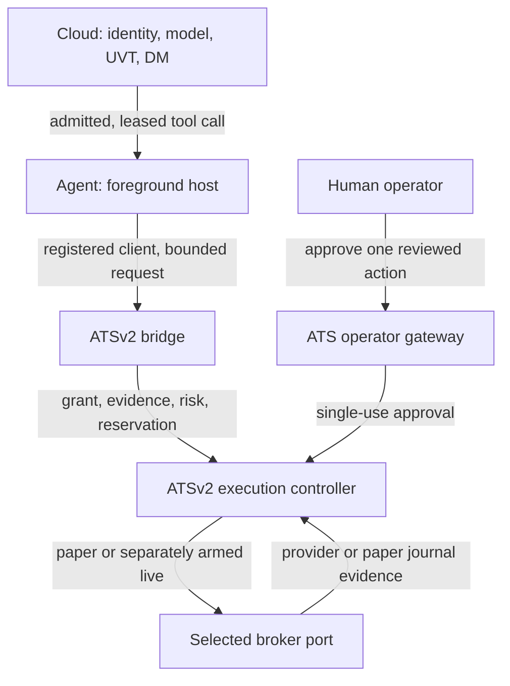
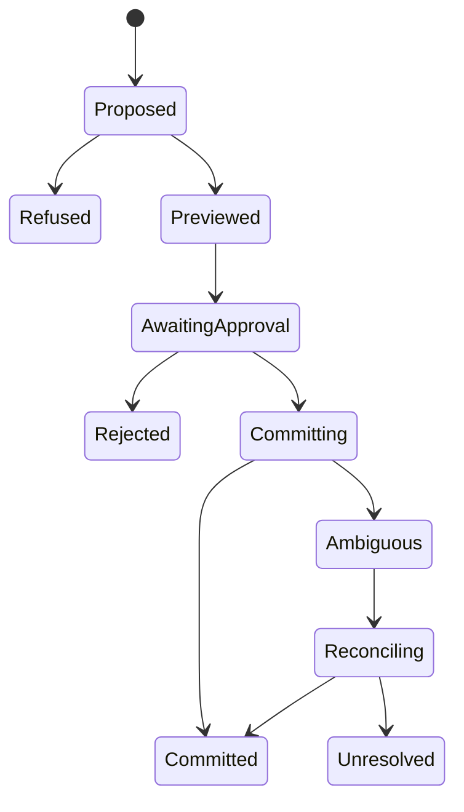

# Aether Agent × ATS: paper and live execution completion specification

**Status:** implementation specification; no order or deployment authorized by this document  
**Audit:** 2026-09-23 UTC  
**Agent source:** [`AetherAI3/Aether-Agent@1337b131`](https://github.com/AetherAI3/Aether-Agent/tree/1337b131778d17ad17cb8b37249297bcc83eb8f7), merged [#159](https://github.com/AetherAI3/Aether-Agent/pull/159), [#160](https://github.com/AetherAI3/Aether-Agent/pull/160), [#161](https://github.com/AetherAI3/Aether-Agent/pull/161)  
**ATSv2 source:** [`AetherAI3/ATSv2@ecdbc5c`](https://github.com/AetherAI3/ATSv2/tree/ecdbc5c296f28f2331aea4e031c459f1171b99ea)  
**Companion:** [managed ATS read-only tool-host contract](https://github.com/AetherAI3/Aether-Agent/blob/1337b131778d17ad17cb8b37249297bcc83eb8f7/docs/specs/2026-09-22-managed-ats-tool-host-v1.md)  
**Prior baseline:** `AETHER_AGENT_V0.4.0_RELEASE_AND_ATS_EXECUTION_GAP_SPEC.md` (2026-09-22). Its E1–E5 intent still applies, but its audited main SHA predates #159–#161. This document supersedes its implementation-state claims.  
**Superseded in part:** for the Agent Browser mission — a trading site the user signs in to, driven by a qualified site adapter — the provider-API-only routing in §1 (destination 2), G7 and G8 is superseded by [`2026-09-23-ats-agent-browser-orders.md`](2026-09-23-ats-agent-browser-orders.md) §7 and the frozen `agent-browser-ats-order/1` contract ([#164](https://github.com/AetherAI3/Aether-Agent/pull/164)). Everything below that forbids generic browser control, raw VNC or screenshot evidence still stands.

## 1. Decision and exact capability truth

There are three distinct destinations:

1. **ATS simulated paper:** A managed ATS agent proposes an equity order; ATSv2's existing controller, grant store, approval gateway and journal-backed `PaperBrokerOrderPort` review and, after a human's one-time decision, record an ATS-only paper fill. This is the first executable milestone. The simulator never sends an order to a provider.
2. **Provider sandbox/paper:** A separately integrated broker's documented non-live account receives an order and returns authoritative sandbox status and fills. This is a separate qualification, not evidence supplied by the ATS simulator.
3. **Live capital:** A live broker adapter submits to one explicitly selected real account under separate, expiring authority and hard risk limits, initially with human approval for each order. No setup, model, agent, or mode toggle can infer this authority.

The current Agent has ATS setup, strategy scans, contracts, a guarded runtime installation/supervision *framework*, and honest refusal states. It **does not have a production runtime installer, a running authenticated ATS channel, an admitted Cloud-to-local tool invocation, or an Agent-to-ATS paper order path**. ATSv2 has a much more developed delegated-paper implementation, but its existence in another repository is not evidence that this managed Agent can use it. Neither repository audit proves a live broker production release.

| Surface | Verified at audited source | Remaining executable work |
|---|---|---|
| Managed ATS agent, account scope, consent, shared DM client | Agent setup and chat code; policy receipt does not grant authority | Real Cloud account/DM/model/UVT canary; E1 host session and result custody |
| Nano and local data | Native compile scan and library; settings `order_execution_mode: paper`, `execute_live: false`; research data is configured but not probed | Authenticated native activation; actual probe; executable snapshot/quote/rights, distinct from research feed |
| Trading contracts | Agent #160 closed validators for equity, grants, account binding, review, approval, receipt; #161 adds runtime/data/strategy/journal shapes and JCS canonicalization | Map to ATSv2 Python contracts with cross-language executable conformance and a versioned transport; validators alone do not store, route, or execute |
| Runtime scaffold | Signature/size/archive verification, slot receipts, PID ownership, doctor, restart/rollback in `src/core/ats_runtime/` | Entitled manifest source, independent published signing anchor, archive fetcher, confined extractor, launcher, authenticated identity/capability probe; then packaged OS canaries |
| `/ats` UX | `status`, `doctor`, `runtime`, `strategies`, `library`, `data`, `journal`, browser lifecycle | Read-only host, activation, grant/target, pending approvals, orders/positions, reconciliation and operator controls |
| ATSv2 delegated paper | `BridgeGateway` grant-scoped discovery; `ReviewService` calls the native controller without commit; `SubmitService` + `OperatorApprovalGateway` + single-use approval, reservation, journaled paper fill and reconcile | Enroll Agent instance, production transport/configuration, two-principal auth, interprocess owner/locks, user-facing decision card, live canary and adversarial soak |
| Live provider | ATSv2 controller has bounded broker ports and validation | Choose provider, contract, credential custody, data rights, live adapter, venue-specific tests, separate live arm and approval, canary/rollback evidence |

**Source anchors:** Agent [`ats_agent.ts` lines 503–651](https://github.com/AetherAI3/Aether-Agent/blob/1337b131778d17ad17cb8b37249297bcc83eb8f7/src/commands/ats_agent.ts#L503-L651), [`install.ts` lines 62–160](https://github.com/AetherAI3/Aether-Agent/blob/1337b131778d17ad17cb8b37249297bcc83eb8f7/src/core/ats_runtime/install.ts#L62-L160), [`supervisor.ts` lines 212–230](https://github.com/AetherAI3/Aether-Agent/blob/1337b131778d17ad17cb8b37249297bcc83eb8f7/src/core/ats_runtime/supervisor.ts#L212-L230), [`manifest.ts` lines 361–375](https://github.com/AetherAI3/Aether-Agent/blob/1337b131778d17ad17cb8b37249297bcc83eb8f7/src/core/ats_runtime/manifest.ts#L361-L375), [`doctor.ts` lines 243–260](https://github.com/AetherAI3/Aether-Agent/blob/1337b131778d17ad17cb8b37249297bcc83eb8f7/src/core/ats_runtime/doctor.ts#L243-L260); ATSv2 [`ats-mcp/README.md` lines 83–149](https://github.com/AetherAI3/ATSv2/blob/ecdbc5c296f28f2331aea4e031c459f1171b99ea/ats-mcp/README.md#L83-L149), [`paper_broker.py`](https://github.com/AetherAI3/ATSv2/blob/ecdbc5c296f28f2331aea4e031c459f1171b99ea/ats-mcp/ats_mcp/paper_broker.py), [`execution_controller.py`](https://github.com/AetherAI3/ATSv2/blob/ecdbc5c296f28f2331aea4e031c459f1171b99ea/llmre/execution_controller.py).

### 1.1 Important corrections to stale plans

- Agent #159 is **a merged read-only E1 contract**, not a running host. Its v1 wire objects deliberately exclude order review, submission, approval, reconcile, credentials and live capital. Add a separately versioned execution channel after E1; never smuggle order fields into the E1 status tool.
- Agent #160/#161 **merged** after the earlier report. The previous plan's “freeze schemas” and “fix strategy count” are complete in Agent. Production adapters and ATSv2 mirror conformance are still unproven.
- Agent's current `canonical.ts` uses `rfc8785/1`; floats are accepted by the encoder but rejected in monetary/quantity validators. #160's older PR-body description of a stricter integer-only encoder is superseded by #161's repaired code. Test non-ASCII, UTF-16 key order, fractional input and Python interoperability.
- `doctor.paper_ready` currently means installed healthy runtime + compiled strategy + freshly verified configured symbols. It **does not** include grant, target, broker preview, human approval or an executed paper order. Rename/display as **paper activation prerequisites** until full order readiness is measured; `broker_live_ready` is pinned false.
- ATSv2 main at audited SHA does not contain Agent's new `ats_contracts_golden.json` mirror. The Agent docs describe a planned Python mirror; treat cross-repo parity as a deliverable requiring actual ATSv2 files/tests, not as a passed gate.
- The current ATSv2 delegated `PaperBrokerOrderPort` journals synthetic fills and carries no provider credential or order client. A “paper order executed” receipt must say **ATS simulated paper** until a distinct provider sandbox adapter is integrated.

## 2. Authority, trust and placement



**One authority:** ATSv2 owns client registry, provider/account binding, grant, reservation, policy, strategy activation, executable market evidence, preview, atomic approval consumption, risk, kill state, idempotency, normalized orders/fills, ledger and reconciliation. Agent carries typed requests and renders verified replies. Cloud admits model turns and delivers the DM; Cloud tool admission is not ATS execution permission. A device/browser screenshot cannot authorize an order or verify a fill. Aether AI model or another agent cannot act as the human operator.

**Physical placement:** The DigitalOcean account currently shows active VPS2, VPS5, VPS3/CI and VPS6/CI droplets. This confirms compute existence only. It does not prove an ATS runtime, an authenticated broker session, a deployed host lease, or a working canary on any droplet. The first execution host should be the explicitly enrolled, user-controlled device where ATS credentials and local operator decisions are owned. A remote host requires its own documented custody and operator-presence design. Do not schedule qualification on VPS6/CI while reserved for other work, and do not infer trading authority from a droplet tag.

### 2.1 Four independent identities and a single target

1. Cloud principal: origin + authenticated subject + managed agent + conversation/run.
2. Host principal: enrolled device/instance + foreground session + short lease; teardown on logout, account switch, lease expiry, process exit.
3. ATS bridge principal: registered client instance, operator, provider/account binding, grant ID/version and capability; match the Cloud principal through a reviewed enrollment mapping.
4. Human operator principal: a **separate** ATS-authenticated session for pending cards, approve/reject and reconciliation. It is not the model's bridge credential.

The actual order target is one ATSv2-minted opaque account reference plus immutable provider/environment/binding generation. A display name or chat selection cannot choose it. Approval and commit must compare the same target and environment again at the moment of commit. Changing any target, grant version, intent, preview, snapshot, quantity, policy or adapter digest expires the review; create a new request.

### 2.2 Environment labels are semantic, not UI colors

| Environment | Submission endpoint | Fill authority | Permitted initial policy |
|---|---|---|---|
| `ats_paper` | ATSv2 local paper journal | ATS simulator | First executable milestone; equity, whole shares, per-order approval |
| `provider_sandbox` | Broker's documented test/paper endpoint | Provider test account | Later adapter-specific gate with separate credentials and account binding |
| `provider_live` | Broker's live endpoint | Real provider account | Separate live-arm, smallest practical bounds, one operator-confirmed canary |

No route may silently reroute among these environments; no approval minted against one is valid in another. A simulated paper fill must not be reported as broker-confirmed or as evidence of market liquidity, slippage or P&L performance.

## 3. The remaining gaps, ordered by dependency

### G0 — Release/source truth and contract reconciliation (blocker to transport)

**Agent:** Verify current release/tag/installed binary and keep user copy explicit about source candidate versus published version. The README already says no execution. Change `/ats doctor` wording to distinguish activation prerequisites from order readiness; show `requested`, `effective`, environment, grant and operator session independently. Keep `custom` settings readable but degraded until versioned `/1`→`/2` migration; do not delete an existing user setup to force a new provider schema.

**Agent ↔ ATSv2:** Freeze one executable cross-language mapping for each of `connector-capability`, `account-binding` redaction, `delegated-trading-grant`, `equity-order-intent`, `order-review-receipt`, `operator-approval`, `execution-receipt`, runtime capability and strategy activation. Decide whether ATSv2 implements these exact JSON wire schemas or whether a narrowly reviewed translation sits entirely at its private gateway. Pin JCS bytes and digests from Agent fixtures on both sides. The canonical ATSv2 `bridge_contract.py` and Agent TS contracts currently have different native vocabularies; matching prose is insufficient.

**Acceptance:** a single script in CI runs the exact pinned Agent and ATSv2 fixtures in Node and Python and fails on any field, enum, unit, default, digest or redaction drift. Negative vectors include unknown fields, non-ASCII and astral keys, floats in monetary fields, wrong environment, altered account generation, approval replay and `ambiguous` marked safe-to-retry. A contract change requires a new schema version and migration, never an implicit widening of `/1`.

### G1 — Close Agent runtime production seams

Implement production `EntitledManifestSource`, independently pinned signing anchor and rotation, bounded archive fetcher, **during-extraction** path/entry/size confinement, launcher and authenticated instance/capability probe. Keep the existing verify → stage inactive slot → fsync receipt → pointer switch → launch ordering. The post-extraction walk cannot undo an out-of-slot write; extractor enforcement must happen before each write. The selected runtime binary and native Python ABI must be pinned per OS/architecture. Credential file belongs to the ATS runtime and must not appear in logs, manifests or prompts. An imported “existing installation” remains unstartable until provenance is verified.

Implement the actual `/ats runtime install|start|status|restart|rollback` dependency injection in production. Today `install` uses the unavailable default source, `start` passes `{}` without a spawn implementation, and `status` passes `{}` without a probe. Add bounded timeout, cancellation and a signed/authenticated challenge that binds expected runtime instance, install digest, device/account and capability timestamp. Preserve the PID reuse and account-switch teardown protections. Do not equate a live process with a functioning broker.

**Acceptance:** clean installed npm artifact on Windows and Linux; signature tamper/rotation/expiry, hostile archive, crash at every slot transition, PID reuse, stale capability, account switch, rollback after tamper, no leaked process/credential; real native runtime reports effective `observe`, actual capabilities and reason. Doctor remains `offline` on missing transport, auth or probe. This qualifies runtime lifecycle only.

### G2 — Deliver the read-only E1 host and executable data truth

Implement #159 in Cloud (lease, model admission, durable invocation/result custody and same-DM delivery), Agent (enrolled foreground host, exact registry, replay fence and teardown), and ATSv2 (authenticated bounded observer status). First canary is exactly **one** `ats_workspace_status` invocation; browser observation is a later owner-bound tool with untrusted output. Never offer the new paper review/submit tools under E1's read-only lease or schema.

Wire `/ats data probe` to a real timed data probe and store a perishable receipt. Research feeds such as YFinance or a configured Polygon URL cannot mint execution evidence. ATSv2 must issue named, rightfully usable, fresh market snapshot and broker quote identities with instrument, account/provider, timestamp, lineage/quality and session context. Paper activation must refer to the exact compiled artifact and native strategy activation receipt; source edits, compiler/runtime change, revoked rights or account change invalidate it. Check market and quote freshness again at review and immediately before commit.

**Acceptance:** one same-DM read-only tool call with admitted model/UVT receipt; duplicate delivery executes local tool once; revoked host/changed account executes zero; runtime outage still allows safe local status; stale, wrong-symbol, delayed, rights-expired or divergent evidence cannot pass an order preview. A research-only provider never appears as an executable quote.

### G3 — Agent bridge enrollment, target and grant UX

ATSv2 already has durable `ClientRegistry`, `GrantStore`, capability-scoped discovery and invocation-time revalidation. Create an operator enrollment flow for the **actual Agent device instance**, tying Cloud subject, agent ID, host lease and ATS registry client. Broker credentials stay in ATSv2's owner-controlled secret store; Agent sees opaque binding, masked label, provider, environment, grant and status only. Provide `/ats execution target`, `grant status/revoke` or a deep link to ATSv2's canonical operator control. Creation and widening require a separate authenticated operator action. Zero grants and an empty symbol allowlist mean zero execution.

For the first `ats_paper` grant: one named client, one selected paper account, one equity symbol, buy and closing-sell only if supported, whole shares, market or limit only as explicitly implemented, low notional/quantity/daily/position caps, short expiry, `per_order`, no wildcard, no standing approval. Only ATSv2 may reserve/debit the limits. Concurrency at the final remaining unit must be atomic; reservation reaping must not release a `COMMITTING` request. Any revoke or narrowing is effective at invocation and commit regardless of a cached tool catalog.

**Acceptance:** wrong subject/device/agent/client/provider/account/environment is refused; revoked/expired grant refuses even if advertised earlier; at most one active writer/bridge for the same local ATS state directory. The current ATS MCP README assumes a single process owns the state directory and has no distributed lock; enforce the owner lease or refuse a second runtime before production deployment.

### G4 — Paper proposal → controller review → immutable operator card

Add a **new versioned execution tool contract** separate from E1. The model may propose bounded `NormalizedEquityOrderIntentV1` data with strategy, symbol, side, integer quantity, type, evidence refs and expiry; it cannot choose operator, provider account, environment, grant, approval or transport URL. ATSv2 injects those from its authenticated binding. Reuse the current `ReviewService` and native `llmre.execution_controller` for validation, risk, quote and provider preflight; the review-only broker must be incapable of committing. ATSv2 writes a durable request, reserved bound and immutable preview identity/digest, then returns `awaiting_approval` with expiry.

Agent shows an operator card that includes `ATS simulated paper`, requester agent/device, exact opaque/masked account, symbol, side, quantity, order type/limit, worst-case cost, current position/daily usage, risk verdict, market/quote age, preview and reservation expiry, target/environment/adapter digest and **Approve once / Reject**. Text from a model, broker, webpage or notification cannot synthesize or alter the card. A card with missing evidence or expired preview is display-only. Web and terminal views, if both offered, must point to the same ATSv2 request; a Cloud DM acknowledgment does not approve it.

**Acceptance:** unsupported symbol/asset/short/order type, stale quote, changed strategy, stale binding, wrong grant, malformed proposal, prompt injection and cross-environment preview are refused without a paper fill. Exactly one pending card exists per request ID, survives restart, and its bounded status is visible to its authenticated owner. A model tool cannot call operator methods.

### G5 — Authenticated paper approve-once, receipt and ambiguity

Expose ATSv2's existing `OperatorApprovalGateway` through a separate local operator session or equally strong human authentication. The gateway's `APPROVE_ONCE` mints a hash-bound approval and finalizes under one per-request lock; `REJECT` is terminal. Immediately before commit ATSv2 checks subject/client, active grant revision, selected binding generation, mode, kill state, risk, reservation, strategy, data rights/freshness, intent, preview and approval digest. Approval consumption is atomic. The only first-wave commit port is `PaperBrokerOrderPort`. Agent forwards the outcome and safe receipt references to the same DM and a local journal; authoritative state remains ATSv2's journal. A chat delivery failure retries **stored delivery**, never the commit.

Transport loss after an attempt may have begun is `AMBIGUOUS`. It is not `FAILED` simply because the UI timed out. The pending card remains discoverable across process restart. Operator `reconcile` reads ATS paper journal/order evidence using the original idempotency reference; it never submits again. In provider sandbox/live lanes, reconciliation must use the provider's order lookup/event stream and preserve unknown if neither proves existence nor nonexistence. No speculative auto-retry of a commit.

**Acceptance:** approve one request once produces at most one journaled order; duplicate approve, duplicated Cloud tool delivery, restart in `COMMITTING`, transport timeout after journal fsync, revoked grant after preview, concurrent last-budget requests and wrong operator each produce the specified refusal or reconcile-only state. Every displayed fill comes from ATS journal (`ats_paper`) or later provider truth, with environment stamped and traceable.

### G6 — Operator controls and lifecycle after commit

Expose read-only orders/positions, pending approvals and unresolved ambiguity independently of model quota; add authenticated `/ats halt engage`, cancel and flatten where the relevant ATSv2 broker port supports them. For `ats_paper`, implement/reuse ATSv2 paper cancel/position semantics and proof; do not label a simulator reset “broker cancel.” For any live adapter, cancel/flatten must use provider-confirmed receipts. Clearing global halt must be an explicit stronger operator action, never a model tool or automatic restart. On disconnection, trade APIs close but status, emergency halt, cancellation, credential revoke and reconciliation remain available through an independent operator route.

Journal projections include request/decision timestamps, principals, bound digests, risk/limit/kill decisions, environment, preview and provider order/fill refs, reconciliation status and safe error codes. Strip secrets, account numbers, raw broker responses, prompts, strategy source, browser text/images and local filesystem paths. Simulated equity curve, external broker balance and verified fills are separate displayed measures.

**Acceptance:** loss of Cloud, UVT exhaustion, runtime restart, data outage, broker read outage or account switch cannot silently hide unresolved work or turn a halt off. Emergency actions have their own receipt and are available without generating a model response.

### G7 — Provider sandbox qualification (optional intermediate release)

Two routes can qualify. The browser route — a site paper account reached through a qualified site adapter under `agent-browser-ats-order/1` — needs no broker API and is specified in `2026-09-23-ats-agent-browser-orders.md`. For the API route, choose one broker with a documented API and sandbox/paper environment and verify terms, supported order types, market data entitlements and scopes. Build a distinct adapter and credential ref for `provider_sandbox` with endpoint allowlist and certificate/TLS checks; never reuse production tokens or infer sandbox from a hostname string supplied by an agent. Bind capability snapshot, account generation, preview identity, approval and provider idempotency reference to the endpoint environment. Normalize provider statuses and partial fills into ATSv2 receipts; provider fills are sandbox facts only. Run restart, cancel, partial-fill, reject, market-closed, quote stale, rate limit, timeout and unknown-order drills.

**Acceptance:** one non-live provider order observed through its API, or through the site's own order history on the browser route, and independently reconciled to account/position/ledger; zero live requests in route logs. The audit retains a separate proof of which endpoint/credential/environment was used. This gate does not inherit the simulator's “passed” status.

### G8 — Separate live-capital program

Live is a new versioned grant/arm and a separate release decision after G0–G6 and, if the broker provides one, G7. Freeze provider, account, asset class, instruments, order types, hours, maximum per-order and aggregate exposure, position/daily loss, quote freshness, cancellation and expiry **before** coding the canary. Start with one account, one provider, one equity symbol, minimum practical whole-share exposure, no leverage, no short opening, no options, no transfers, no auto mode and **human approve-once per order**. Enforce hard limits server-side in ATSv2 and independently inside the broker adapter where possible. Live arm expires and is not restored after restart, account switch or credential rotation.

Implement separate OS-protected live credential custody with least-privilege order scopes and owner-visible revocation, production endpoint pinning, broker account and trading-hours readiness, stale/closed-market refusal, broker-side idempotency or equivalent lookup, partial fill, cancel/replace and corporate-action/position reconciliation. The controller must refuse if any cap, kill switch, rate limit, market-data rights or confirmation cannot be checked. Keep broker API calls bounded and send only structured allowlisted parameters. No generic browser clicks, raw VNC, raw agent shell, MCP pass-through or free-text order endpoint can be a fallback. A reviewed site adapter executing `agent-browser-ats-order/1` under ATSv2's browser order-ticket port is a separately qualified primary route, not a fallback (see `2026-09-23-ats-agent-browser-orders.md` §7).

Run read-only provider account/order/positions truth first, dry-run preflight with submit disabled, then a **separately authorized** founder-operated one-order canary. Compare provider order, fill, position, ATS ledger and account statement; test kill and cancel; record exact code/contract/adapter/credential-generation/approval/route evidence. Any discrepancy, unknown order outcome or missing independent review returns the release to HOLD. A clean small canary permits a bounded soak, not a blanket autonomous rollout.

An unattended live mode is a later proposal requiring its own policy, authority and adversarial assessment. The Agent enum admitting `auto` as a shape is not a release decision.

## 4. Failure model: the executable state machine



`Previewed` and `AwaitingApproval` expire; expiry is terminal for *that request*. `Committed` requires a journaled ATS paper fill or provider-confirmed order/fill evidence with explicit environment. `Ambiguous` freezes all commit/retry paths for the request. `Unresolved` remains operator-visible; neither missing logs nor absence of a UI notification proves no order occurred. A fresh proposal after a terminal refusal has a **new** intent and evidence set. Model tool-call dedupe (Cloud/Agent) and order-idempotency (ATSv2) are different keys and both must be durable.

| Failure | Required behavior | Evidence |
|---|---|---|
| Host lease expired/account switched | Revoke tool offering, stop invocation, tear down local resources; preserve ATS pending/ambiguous state under original principal | Lease and cleanup receipts |
| Runtime signature/probe unavailable | No activation, review or new order; safe status and operator halt still work | Verified install/capability or typed refusal |
| Data stale or rights missing | Refuse preview/commit even if a prior probe was green | Current snapshot/quote/rights IDs |
| Grant revoked/binding generation changed after review | Refuse approval/commit, release only safe reservations | ATS grant revision and tombstone |
| Duplicate tool/approval/request | Return stored result or refuse consumed approval; never second commit | Cloud call key, ATS request key, atomic approval |
| Provider call returns unknown/timeout | `AMBIGUOUS`, no retry; reconcile by original provider ref | ATS ledger + provider/journal lookup |
| DM delivery fails after success | Deliver stored receipt again; do not invoke ATS | Durable result digest and delivery attempt |
| Kill engaged during flow | New review/submit refused; safe cancellation/read routes continue | Kill state and action receipt |

## 5. Concrete PR train and merge gates

Split work by authority boundary. Each PR starts at current main, references an exact dependency SHA, updates golden vectors/generated docs/operator packet as appropriate, and passes its own security review and required CI. No future PR should treat a green TS validator test as proof of a Python execution path.

| Order | Repository / suggested PR | Deliverable | Gate to merge |
|---|---|---|---|
| 0 | Agent `docs(ats): reconcile readiness and paper/live terminology` | Rename readiness display; correct cross-repo mirror claim; freeze this spec and contract map | Truth tests, doc checks, no code path for order mutation |
| 1 | Agent + ATSv2 `test(ats): lock cross-language execution wire` | Exact schemas/translation, JCS vectors, negative/replay vectors in both languages | Same fixture digest and refusal matrix on both exact heads |
| 2 | ATSv2 + Agent `feat(ats): entitled runtime transport and authenticated probe` | Source/pin/fetch/extract/launch/identity probe, OS packages | Real signed binary canary, tamper/restart/rollback tests |
| 3 | Cloud + ATSv2 + Agent `feat(ats): E1 workspace status host` | Implement #159 one-tool read-only path | Same-DM canary, one invocation, zero execution authority |
| 4 | ATSv2 + Agent `feat(ats): data/evidence and strategy activation` | Probe, native activation, executable quote/ref separation | Stale/rights/mismatch battery; paper preview still disabled |
| 5 | ATSv2 + Agent `feat(ats): enroll bridge and immutable paper review` | Registry/grants/target, review-only controller, pending card | No commit path; principal, grant and environment adversarial tests |
| 6 | ATSv2 + Agent `feat(ats): approve-once simulated paper and reconcile` | Human gateway, durable paper commit, typed receipt, ambiguity, operator controls | Full restart/replay/failure battery and actual ATS simulator canary |
| 7 | ATSv2 + Agent `feat(ats): provider sandbox` | One documented test endpoint and provider receipt flow | Provider-side account/order/fill reconciliation; zero live calls |
| 8 | ATSv2 + Agent + Cloud `feat(ats): bounded live canary` | Separate policy/live-arm, live adapter, operator UX, kill/rollback | Independent review, legal/provider applicability review, one approved real order and provider proof |

Parallel repository work is fine where interfaces are frozen, but **merge dependency is sequential**: #159 runtime is prerequisite to model-visible paper proposals; data and native activation precede any review; paper review precedes operator commit; completed paper adverse-state qualification precedes live. Do not share a Cloud model tool credential with the operator RPC. Operator routes remain available when a model cannot be admitted.

### 5.1 A minimal paper milestone with an honest scope

If speed matters, PRs 0–2 can be limited to the path required for one user-controlled Windows Agent device and one ATS runtime build. E1 then proves one read-only tool. PRs 4–6 prove **ATS simulated paper** for a single symbol/account with per-order human approval. Deliver the UI even if Cloud chat remains unable to send a model proposal by allowing a deterministic, operator-started structured proposal through the same ATSv2 review path; label that as an **operator-driven paper canary**, not “managed agent trading.” Model-originated success requires the E1/next-version host with actual admitted tool invocation. No shortcut may bypass ATSv2's grant/risk/approval store.

## 6. Required end-to-end verification

### 6.1 Scenario matrix

| Gate | E1 read-only | ATS simulated paper | Provider sandbox | Live canary |
|---|:---:|:---:|:---:|:---:|
| Agent Linux/Windows packaged clean install, exact-head CI, CodeQL | ✓ | ✓ | ✓ | ✓ |
| ATS Python/Electron contract conformance, pinned runtime digest | status subset | full | full | full |
| Cloud authenticated same-agent/same-DM model/UVT canary | ✓ | ✓ for model proposal | ✓ | ✓ |
| Native strategy activation, fresh data rights/snapshot/quote | diagnostic | ✓ | ✓ | ✓ |
| ATS bridge principal, grant, explicit target, review receipt | — | ✓ | ✓ | ✓ |
| Separate operator identity, approve once, rejection/replay | — | ✓ | ✓ | ✓ |
| Restart at each lifecycle edge, ambiguous reconciliation | tool replay | ✓ | ✓ | ✓ |
| Last-bound concurrency, halt/revoke/account switch | read subset | ✓ | ✓ | ✓ |
| Actual external provider order/status/fill | — | — | sandbox only | live only |
| Legal/provider applicability, independent review, founder decision | policy scope | paper scope | provider scope | mandatory before arm |

Create a machine-readable run receipt per scenario: exact Git SHAs and package digests, OS/runtime version, environment and endpoint class, account/client/grant references (opaque), actor roles, intentionally bounded risk/UVT/spend, all request/preview/approval/provider/journal IDs, expected and observed lifecycle, injected fault and final verdict. Pin test fixtures to the exact code/contract; a successful simulated test must never be recycled as a sandbox/live proof.

### 6.2 Release thresholds and stop conditions

- **E1 GO:** one genuine admitted `ats_workspace_status` call in same DM; zero duplicate local calls after replay/renewal/restart; zero order authority or credentials on E1 wire.
- **Simulated paper GO:** one approved equity proposal returns a single durable `ats_paper` order/fill, with grant and operator trace, then complete adversarial battery passes. A second attempt after ambiguous commit is refused; only evidence-based reconcile progresses.
- **Sandbox GO:** provider test account shows matching order and fills through read API, with partial fill and outage drills. Paper simulation cannot satisfy this gate.
- **Live GO:** signed exact-head operator release record and provider/legal review; verified controls, independent security review, isolated credential, read-only account reconciliation, one separately approved minimal-exposure canary, then broker and ATS ledger agree. Until that record exists: `HOLD / NO LIVE CAPITAL`.
- **Immediate rollback/HOLD:** unknown provider outcome, leaked credential/account number, wrong environment, account-target swap, grant/revocation bypass, duplicate order, unreconciled fill, broken kill/cancel, missing quote rights/freshness, CI/contract mismatch, unreviewed executable change. Rollback disables *new* orders; reconciliation and emergency controls remain online.

## 7. UX copy and operator checklist

Proposed `/ats status` rows: `Cloud identity & DM`, `Local session & runtime`, `Research data`, `Executable market evidence`, `Strategy activation`, `Target & environment`, `Grant & effective mode`, `Paper/live order readiness`, `Pending approvals`, `Ambiguous requests`, `Last receipt`, `Halt state`. Each row shows timestamp, source and reason. Do not turn them into one green “ATS ready” badge.

Proposed command evolution (actual authorization always in ATSv2):

```text
/ats runtime status|install|start|stop|restart|rollback
/ats data probe
/ats strategy activate <strategy-id>
/ats execution status|target
/ats grants status|revoke
/ats approvals [get <request-id>]
/ats approve <request-id>        # separate authenticated human session only
/ats reject <request-id>         # separate authenticated human session only
/ats reconcile <request-id>      # evidence only
/ats orders; /ats positions
/ats halt engage; /ats cancel <order-id>; /ats flatten <position-id>
```

Display an order card's environment and target before the approve action; show an expired/changed card as disabled with its exact reason. Render `ATS simulated paper`, `Provider sandbox` and `Live real capital` with text, not color alone. Keep notifications informational; a notification click must open the canonical card and reauthenticate rather than commit. Never put broker login fields, secrets, screenshots or raw provider data in chat. One-shot terminal commands must release writer/browser/tool-host leases before abort, preserving the ordering fixed by Agent #156.

## 8. Ownership, external review and open product decisions

| Decision | Owner | Required before |
|---|---|---|
| Runtime signing authority, artifact distribution and entitlement | ATSv2 + Agent release owners | G1 |
| Cloud host enrollment, lease/result custody, DM contract | AETHER-CLOUD + Agent | G2 |
| TS/Python canonical execution wire and authoritative migration | Agent + ATSv2 | G3–G5 |
| Broker choice, supported instruments, sandbox availability and terms | ATSv2 product/operator | G7 |
| Live risk numbers, hours, fail-safe operator and actual canary account | Trading program owner and independent reviewer | G8 |
| Which business entities/venues and communications rules apply | Qualified counsel/compliance reviewer | Production paper advertising and any live release |

FINRA's [AI guidance](https://www.finra.org/rules-guidance/notices/24-09) addresses member-firm supervision of AI tools; the SEC has [enforced against false AI-use claims](https://www.sec.gov/newsroom/press-releases/2024-36), and the CFTC [warns about guaranteed-return AI trading bot claims](https://www.cftc.gov/LearnAndProtect/AdvisoriesAndArticles/AITradingBots.html). Applicability to Aether's exact business and accounts is a counsel decision; the engineering release record must not claim profitability, fully autonomous execution or a broker integration before it is demonstrated.

**Open choices to freeze at G7/G8, not guess today:** broker/provider and API, instrument universe, specific numeric caps, whether a supported sandbox exists, venue/data licensing, jurisdiction and account holder, cloud-versus-local operator presentation, and emergency contact. The initial G0–G6 plan is actionable without these choices because it is explicitly ATS simulated paper and separately authenticated local operator approval.

## 9. Definition of done

**Managed Agent simulated paper:** an admitted managed ATS agent proposes a structured, evidence-bound equity action through a versioned execution tool; ATSv2 confirms one current grant, target, strategy, market evidence, limits, controller preview and unhalted mode; a separately authenticated person sees the immutable card and approves once; ATSv2 journals exactly one `ats_paper` order/fill or a typed refusal; the terminal and DM show the same durable receipt; after any crash or timeout the original request is discoverable and reconcile-only if ambiguous. None of this uses an external broker account.

**Live capital:** all simulated-paper and applicable sandbox evidence above, plus a chosen provider's real endpoint, least-privilege credential and real account binding, approved numeric bounds, explicit expiring live arm, per-order human confirmation, emergency controls, independent release review and a founder-authorized one-order canary whose provider order/fill/position and ATS ledger agree. Until those proofs exist, the truthful status is `HOLD / NO LIVE CAPITAL`.
